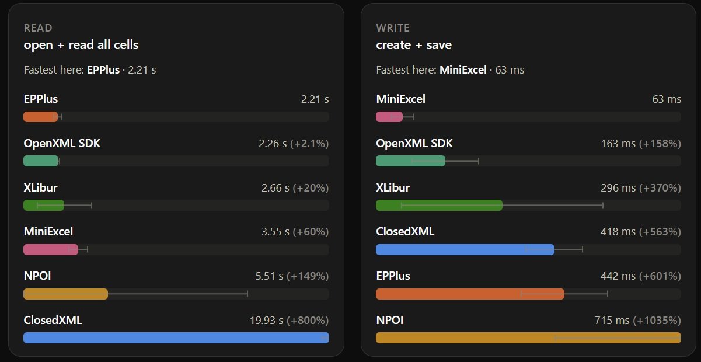

# XLibur


[](https://github.com/XLibur/XLibur/actions/workflows/build-and-test.yml)
[](https://www.nuget.org/packages/XLibur)
[](https://www.nuget.org/packages/XLibur)
[](https://sonarcloud.io/dashboard?id=XLibur_XLibur)
[](LICENSE)

## About

XLibur is a .NET 8+ library for reading, manipulating, and writing Excel 2007+
(.xlsx, .xlsm) files. It provides an intuitive interface over the underlying
[OpenXML](https://github.com/OfficeDev/Open-XML-SDK) API.

XLibur is a fork of [ClosedXML v0.105.0](https://github.com/ClosedXML/ClosedXML/)
(May 2025), created to ship patches and improvements that didn't land upstream.
Namespaces are prefixed with `XLibur` to avoid conflicts with ClosedXML if both
are referenced in the same project.

## Should I use this?

**Stick with ClosedXML** if:
- A library with developers who have had experience with the library over many years.
- A longer term focus on the product.
- You need support for dotnet <8 (net standard, or NET472)

**Consider XLibur if** you want any of the following changes over ClosedXML 0.105:

- **Reduced memory usage and performance gains** - particularly for workbooks with many formatted cells
- **Bug fixes** — several outstanding community issues resolved that are pending upstream
- **Community PR/enhancements** - several community contriubtions or requests have been merged in to this codebase.

> ⚠️ XLibur has limited real-world production history. Use in critical systems at your own discretion.

## Migration from ClosedXML

The public API surface is largely unchanged from ClosedXML 0.105. To migrate:

1. Install the NuGet package (see below)
2. Replace `using ClosedXML` namespace references with `using XLibur`

### Install XLibur via NuGet

The recommended package is **`XLibur.Bundle`**, which installs the core library together with the
default font engine and behaves like ClosedXML out of the box:

```sh
PM> Install-Package XLibur.Bundle
```

Or via the .NET CLI:
```sh
dotnet add package XLibur.Bundle
```

### Font engine configuration (different from ClosedXML)

This is the one area where XLibur's packaging differs from the base ClosedXML package. ClosedXML
bundles [SixLabors.Fonts](https://github.com/SixLabors/Fonts) directly into its core assembly for text
measurement (column auto-fit, row heights, glyph metrics). XLibur instead keeps the **core assembly
free of any font library** and ships the font engine as a **separate, swappable package**. This lets
you pick a font library with a license that suits you and avoids forcing a font dependency on library
authors who don't need one.

What this means when migrating:

- **Install `XLibur.Bundle` (or `XLibur` + `XLibur.Fonts.SkiaSharp`) and no code changes are needed.**
  The default [SkiaSharp](https://github.com/mono/SkiaSharp) engine (MIT-licensed) is **auto-registered
  by XLibur core the first time you create a workbook** — there is no startup call to add:

  ```csharp
  using var wb = new XLWorkbook(); // font engine resolved automatically
  ```

  The default resolves system fonts and falls back to an embedded, metric-only Calibri-compatible font,
  so text measurement works even in headless/serverless environments with no system fonts installed.

- **If you install the bare `XLibur` package with no font engine**, creating a workbook throws an
  `InvalidOperationException` telling you to add a font engine package. This is intentional — it's how
  the core stays font-library-agnostic.

- **To choose a different engine**, install its package and either register it at startup (it takes
  precedence over the auto-registered default) or pass it per workbook:

  | Package | Font library | License | Notes |
  |---|---|---|---|
  | `XLibur.Fonts.SkiaSharp` | SkiaSharp | MIT | **Default.** Auto-registers; ships native binaries. |
  | `XLibur.Fonts.SixLabors.V1` | SixLabors.Fonts 1.x | Apache 2.0 | Pure-managed; matches ClosedXML 0.105's engine. |
  | `XLibur.Fonts.SixLabors` | SixLabors.Fonts 2.x | Six Labors Split License | Commercial restrictions over $1M revenue. |

  ```csharp
  // Override globally at startup (e.g. keep ClosedXML's SixLabors 1.x behavior):
  SixLaborsV1FontBootstrap.Register();

  // Or override per workbook:
  var options = new LoadOptions { FontEngine = new SkiaSharpFontEngine("Arial") };
  using var wb = new XLWorkbook(options);
  ```

Resolution order for the font engine is: `LoadOptions.FontEngine` (per workbook) →
`LoadOptions.DefaultFontEngine` (explicitly registered global) → the auto-registered default engine.
See [docs/font-architecture.md](docs/font-architecture.md) for the full design.

## User Guide

Nothing local. As the library is largely the same as ClosedXML, the [ClosedXML documentation](https://closedxml.github.io/ClosedXML/) is still *mostly* valid for this library.


## Usage

XLibur lets you create and manipulate Excel files without Excel installed — a common use case is generating reports on a web server.
```csharp
using (var workbook = new XLWorkbook())
{
    var worksheet = workbook.Worksheets.Add("Sample Sheet");
    worksheet.Cell("A1").Value = "Hello World!";
    worksheet.Cell("A2").FormulaA1 = "=MID(A1, 7, 5)";
    workbook.SaveAs("HelloWorld.xlsx");
}
```

## Building, Testing, and Benchmarks

Build the solution:

```sh
dotnet build XLibur.slnx
```

Run the test suite:

```sh
dotnet test XLibur.Tests/XLibur.Tests.csproj
```

Published benchmark results are available at
[jafin.github.io/XLBench](https://jafin.github.io/XLBench/charts.html):

[](https://jafin.github.io/XLBench/charts.html)

Run benchmarks yourself (XLibur vs ClosedXML comparison):

```sh
# List available benchmarks
dotnet run -c Release --project XLibur.Benchmarks/XLibur.Benchmarks.csproj -- --list flat

# Run all benchmarks
dotnet run -c Release --project XLibur.Benchmarks/XLibur.Benchmarks.csproj -- --filter *

# Run a specific benchmark class
dotnet run -c Release --project XLibur.Benchmarks/XLibur.Benchmarks.csproj -- --filter '*XLiburWorkbookBenchmarks*'
dotnet run -c Release --project XLibur.Benchmarks/XLibur.Benchmarks.csproj -- --filter '*ClosedXmlWorkbookBenchmarks*'
```

## Developer guidelines

Please read the [full developer guidelines](CONTRIBUTING.md).

## Credits

* ClosedXML originally created by [Manuel de Leon](https://github.com/mdeleone)
* ClosedXML maintainer: [Jan Havlíček](https://github.com/jahav)
* Former ClosedXML maintainer and lead developer: [Francois Botha](https://github.com/igitur)
* Master of Computing Patterns: [Aleksei Pankratev](https://github.com/Pankraty)
