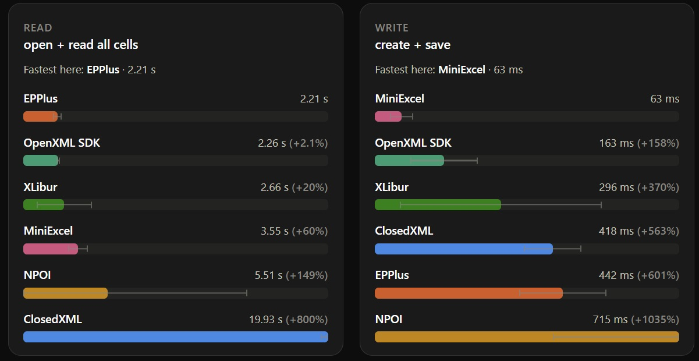

# XLibur


[](https://github.com/XLibur/XLibur/actions/workflows/build-and-test.yml)
[](https://www.nuget.org/packages/XLibur)
[](https://www.nuget.org/packages/XLibur)
[](https://sonarcloud.io/dashboard?id=XLibur_XLibur)
[](LICENSE)

XLibur is a .NET 8+ library for reading, manipulating, and writing Excel 2007+ (.xlsx, .xlsm) files.
It provides an intuitive interface over the underlying
[OpenXML](https://github.com/OfficeDev/Open-XML-SDK) API.

XLibur forked [ClosedXML v0.105.0](https://github.com/ClosedXML/ClosedXML/), to apply patches and improvements that didn't land upstream. Namespaces are prefixed with `XLibur`. Surface API is *mostly* compatible.

📖 **[Documentation](https://xlibur.github.io/XLibur/)** ·
[Getting Started](https://xlibur.github.io/XLibur/getting-started) ·
[Migration from ClosedXML](#migration-from-closedxml) ·
[Benchmarks](https://jafin.github.io/XLBench/charts.html)

## Install

The recommended package is **`XLibur.Bundle`**, which installs the core library together with the
default font engine and behaves like ClosedXML out of the box:

```sh
dotnet add package XLibur.Bundle
```

Or via the Package Manager console:

```sh
PM> Install-Package XLibur.Bundle
```

## Quick start

XLibur lets you create and manipulate Excel files without Excel installed — a common use case is
generating reports on a web server.

```csharp
using (var workbook = new XLWorkbook())
{
    var worksheet = workbook.Worksheets.Add("Sample Sheet");
    worksheet.Cell("A1").Value = "Hello World!";
    worksheet.Cell("A2").FormulaA1 = "=MID(A1, 7, 5)";
    workbook.SaveAs("HelloWorld.xlsx");
}
```

More in the [Getting Started guide](https://xlibur.github.io/XLibur/getting-started).

## Migration from ClosedXML

The public API surface is largely unchanged from ClosedXML 0.105. To migrate:

1. Install `XLibur.Bundle` (see [Install](#install))
2. Replace `using ClosedXML` namespace references with `using XLibur`

**One behavioural difference: font engines.** ClosedXML bundles
[SixLabors.Fonts](https://github.com/SixLabors/Fonts) into its core assembly for text measurement
(column auto-fit, row heights, glyph metrics). XLibur keeps the core assembly free of any font
library and ships the font engine as a separate, swappable package, so you can pick one whose
license suits you.

With `XLibur.Bundle`, no code changes are needed — the [SkiaSharp](https://github.com/mono/SkiaSharp)
engine (MIT) auto-registers the first time you create a workbook, and falls back to an embedded
metric-only Calibri-compatible font so measurement works in headless environments. Installing the
bare `XLibur` package with no font engine throws an `InvalidOperationException` on workbook creation
telling you which package to add.

To use a different engine — including SixLabors 1.x, which matches ClosedXML 0.105's behaviour
exactly — see [docs/font-architecture.md](docs/font-architecture.md) for the available packages,
their licenses, and the engine resolution order.

### Note

Note that as time progresses, the migration path may drift, where possible we'll attempt to provide public API parity with upstream where it makes sense so you can easily test either library without major changes.

## Report templating

`XLibur.Report` generates reports from `.xlsx` templates: author the report in Excel, bind .NET data
to it, and generate the finished workbook. Charts, pivot tables and pictures survive range expansion,
which is the part comparable libraries do not do.

```csharp
using var template = new XLTemplate("SalesReport.xlsx");
template.AddVariable("Company", "Contoso");
template.AddVariable("Sales", sales);
template.Generate();
template.SaveAs("SalesReport-2026.xlsx");
```

See [docs/report-templating.md](docs/report-templating.md) for the template language and tag
reference, and [XLibur.Report.Examples](XLibur.Report.Examples/README.md) for ten worked examples.

## Benchmarks

Published results are available at
[jafin.github.io/XLBench](https://jafin.github.io/XLBench/charts.html). Snapshot from 2026-08-02:

[](https://jafin.github.io/XLBench/charts.html)

## Contributing

Building, testing, and developer guidelines are in [CONTRIBUTING.md](CONTRIBUTING.md).

## Should I use this?

**Consider XLibur if** you want any of the following over ClosedXML 0.105:

- **Reduced memory usage and performance gains** — particularly for workbooks with many formatted
  cells. See the [published benchmarks](https://jafin.github.io/XLBench/charts.html).
- **Bug fixes** — several outstanding community issues resolved that are still pending upstream.
- **Community contributions** — several community PRs and enhancement requests have been merged into
  this codebase.
- **Features with no equivalent in 0.105**, listed below.

### Features beyond ClosedXML 0.105

| Feature | Documentation |
|---|---|
| Dynamic array functions (`FILTER`, `SORT`, `UNIQUE`, `SEQUENCE`, `XLOOKUP`, …) with a spill engine | [Formulas](https://xlibur.github.io/XLibur/formulas) |
| Slicers over pivot tables and tables, and pivot table timelines | [Slicers and Timelines](https://xlibur.github.io/XLibur/slicers-and-timelines) |
| A streaming, append-only writer for exports too large to hold in memory | [Streaming](https://xlibur.github.io/XLibur/streaming) |
| Workbook encryption and decryption | [Encryption](https://xlibur.github.io/XLibur/encryption) |
| Charts implemented across all 78 `XLChartType` values | [Charts](https://xlibur.github.io/XLibur/charts) |
| Threaded comments, read and written as conversations rather than flattened | [Comments and hyperlinks](https://xlibur.github.io/XLibur/comments-and-hyperlinks) |
| A swappable font engine, so you pick a license that suits you | [Fonts](https://xlibur.github.io/XLibur/fonts) |
| Report generation from `.xlsx` templates | [Report templating](https://xlibur.github.io/XLibur/report-templating) |

**Continue with ClosedXML if:**

- You need netstandard2.0 or .NET Framework 4.7.2 support. XLibur targets .NET 8 and above.
- You want a library with a longer track record and a larger pool of maintainers who have worked on
  it for years.


## License

MIT — see [LICENSE](LICENSE).

## Credits

ClosedXML authors who developed the core code we sit on. 
[Manuel de Leon](https://github.com/mdeleone),
[Jan Havlíček](https://github.com/jahav), [Francois Botha](https://github.com/igitur),
[Aleksei Pankratev](https://github.com/Pankraty).
