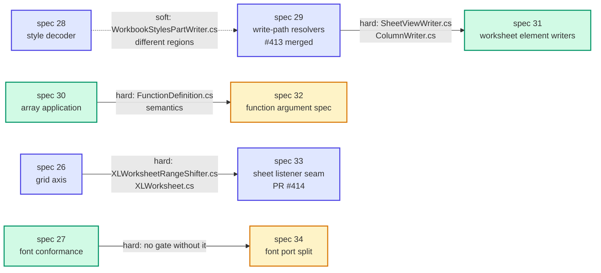

# Tasklist — Architecture deepening, round 2 (specs 26–34)

Progress board and parallel-execution plan for the nine architecture specs that came out of the
**2026-08-24** architecture review. Round 1 (specs 22–25) has its own board in
[TASKLIST-architecture-deepening.md](TASKLIST-architecture-deepening.md).

**Update this file as tasks land.** Tick the boxes, and put the PR number next to the task.

## What this round found

Every one of the nine is the same shape: **one fact has two or more implementations, kept in
agreement by hand.** Round 1 found that shape twice (spec 23's style facades, spec 25's shifter).
Round 2 found it nine times — and this time **four of the agreements have already failed, in shipped
code, uncaught**, plus a fifth inherited from upstream:

| # | Drift | Where | Effect |
|---|---|---|---|
| 26 | Row outline level increments the **column** counter | `XLRow.cs:424-425` copied from `XLColumn.cs:342-343` | `IncrementRowOutline` has zero callers; `@outlineLevelRow` never emitted, `@outlineLevelCol` inflated by row groups. **Round-trip corruption**, not just a create-path bug — the reader sets `OutlineLevel` on load, so opening a grouped file and re-saving inflates it |
| 26 | `GetMaxRowOutline` guards the unfiltered count | `XLOutlineTracker.cs:62-65` vs `:35-39` | Latent: group-then-ungroup leaves a dictionary of zeroes and `.Max()` throws on an empty sequence. **Fixing the defect above makes it reachable on every save** — the two must land in one commit |
| 26 | `XLColumn.CellCount()` always returns 1 | `XLColumn.cs:404-407` character-identical to `XLRow.cs:486-489` | Returns 1 instead of 1,048,576 |
| 28 | Conditional-format fonts drop **three** fields | `LoadFont:202` searches the `<x:rPr>` spellings (`RunFont`, `FontFamily`, no charset) while its three callers all pass a `Font` — unrelated CLR types, no inheritance | Font name, family numbering and charset are silently lost on load. The writer emits all three, so they reach the file and die on the way back |
| 28 | Three dxf callers read different subsets of `CT_Dxf` | alignment read by 1 of 3, protection by none; `WorkbookStylesPartWriter.FillDifferentialFormatsCollection:488-505` decodes dxfs to build the *reuse map* | ✅ Fixed — all six children now read everywhere. **The growth premise was DISPROVED**: `<dxfs>` measured 1,1,1,1 across four saves. `AddDifferentialFormats` calls `RemoveAllChildren()` on the line before, so the reuse map is always empty and can never miss. See DEFECTS D12 |
| 29 | ~~Two spellings of a frozen pane~~ | ~~`SheetViewWriter.cs:124` `frozenSplit` vs `XLStreamingWorksheet.cs:502` `frozen`~~ | **Fixed 2026-08-27.** Both paths resolve through `XLPaneSettings` and write `frozen`; the DOM path also stopped writing `xSplit="0"` for an unsplit axis, which task 1 confirmed it was doing. Four XLibur-authored fixtures pinned the old form and were regenerated |
| 33 | ~~Four sheet features never move on a structural edit~~ | **Measured**, not inferred: after `InsertRowsAbove(3)` + `InsertColumnsBefore(2)`, chart `Position` stayed at row 10/col 3 (should be 13/5), note `Position` at row 9 (should be 12), `SplitRow`/`SplitColumn` at 5/4 (should be 8/6), pivot `Area` at `D10` (should be `D13`) | ✅ **Fixed 2026-08-27.** All four move. The control — a picture — passed **because it allocated a range it did not want purely to get shifted**; that workaround is gone and the picture now moves through the same seam, its behaviour pinned first so the move was a proof. Three new defects fell out: D15, D16, D17. See spec 33's Results |
| 30 | Per-element array arguments discarded | `FunctionDefinition.cs:106-118` builds `itemArg`, calls `_function(ctx, args)` at `:117` | `POWER({2,3,4},{1,2,3})` → `2,2,2` not `2,9,64`; worksheet references affected too, not just literals. **261 of 265 scalar-flagged registrations.** Second presentation: `ToText:1257` has no `[0,0]` branch where `ToNumber:1243` does, so text functions *throw* instead of mis-answering |

None of the five is caught by a test, because in each case the two implementations sit either side of
a seam nothing tests across. **That is the through-line of this round: the missing test is not an
oversight, it is a consequence of the shape.** Where a module has one interface, the interface is
the test surface; where it has two, nothing sits at the seam to assert they agree.

---

## 1. Progress board

| Spec | Title | Effort | Blocked by | Status |
|---|---|---|---|---|
| [26](26-grid-axis.md) | Give the grid one axis | L | — | ✅ **Merged** (#409; see Results) |
| [27](27-font-conformance-suite.md) | One font conformance module | S–M | — | ⬜ Ready |
| [28](28-single-style-decoder.md) | One OOXML style decoder | M | — | ✅ **Merged** (#411; see Results) |
| [29](29-write-path-resolvers.md) | One resolver per emitted element | M | — | ✅ **Merged** (#413; see Results) |
| [30](30-array-application-seam.md) | Array application gets an interface | S–M | — | ⬜ Ready |
| [31](31-worksheet-element-writers.md) | Worksheet element writers get one interface | M–L | 29 ✅ merged | ⬜ **Ready** |
| [32](32-function-argument-spec.md) | Collapse the 61-overload registration | L | **30** | ⬜ Blocked |
| [33](33-sheet-listener-seam.md) | Every sheet feature reacts through one seam | M–L | 26 ✅ merged | 🟡 **PR open** ([#414](https://github.com/XLibur/XLibur/pull/414); merge #413 first; see Results) |
| [34](34-font-port-split.md) | Split the font port: mechanism vs policy | M | **27** | ⬜ Blocked |

### Spec 26 — Grid axis ✅ Merged (#409)

Defect fixes land first, each with the test that would have caught it. Then the collapse, pattern-setter first.
Merged as `2b244064` on 2026-08-26 (squash). Base `c569b95a`, branch tip `c3d23b1a`. Suite green: 28,264 tests, both TFMs.
**See the spec's [Results](26-grid-axis.md#results)** — three acceptance criteria were not met and the
reasons matter more than the misses.

- [x] **26.1** Round-trip test: row grouping emits `@outlineLevelRow` — `021082fd` — PR #409
- [x] **26.2** Fix the outline call **and** `GetMaxRowOutline`'s empty-sequence crash — `021082fd` — PR #409
      *26.1 and 26.2 landed as one commit. The board split the test from the fix; the spec's own work plan
      does not, and its gate is "new round-trip test green". Only two of the four cases fail before the
      fix — defect 1b is genuinely latent, as the spec says.*
- [x] **26.3** Fix `XLColumn.CellCount()`; pin both axes — `4287319e` — PR #409
- [x] **26.4** `GridAxisSymmetryTests` transpose gate; prove it bites under mutation — `557e0898` — PR #409
      *The gate as specified did not bite — it passed under the spec's own `ShiftRowHeights` mutation.
      Strengthened with an entire-line-range case before it would fail. See Results.*
- [x] **26.5** `IGridAxis` + collapse `XLRangeInsertHelper` (226 → 139 lines) — `ae59a8af` — PR #409
- [x] **26.6** Collapse `XLRangeShiftHelper` (144 → 93 lines) — `c4d7c6df` — PR #409
- [x] **26.7** Collapse `XLRangeBase`'s two insert blocks — `c7960715` — PR #409
- [x] **26.8** Collapse `XLWorksheet`'s shift-notification pass; pin page-break/sparkline ordering — `4358822e` — PR #409
- [x] **26.9** Collapse `XLWorksheetRangeShifter`'s six mirror pairs (320 → 222 lines) — `e044eaeb` — PR #409
- [x] **26.10** Cost, and the changelog — `cfcb3bf3` — PR #409
- [x] **26.x** Unplanned: line-size shifting addressed past the sheet edge — `12e922a9` — **PR #410**
      *Split onto its own branch, not folded into 26. Present identically in `ShiftRowHeights` and
      `ShiftColumnWidths` — the spec-26 thesis in miniature. A line pushed off the sheet drops its
      size rather than clamping, matching what happens to its contents.*
      *Not on this board originally; it is the spec's task 9. Allocations fell 12–50% rather than holding
      flat, and the first measurement caught a boxing bug the spec's criterion-9 grep cannot see.*
- [ ] **26.10** Confirm allocation cost unchanged *(revert authority — see below)* — PR #___

**Design constraint from spec 21.** `Point` packs row and column into one `ulong`, and 21 measured a
**+60%** penalty for embedding an enumerator struct by value. So 26 prescribes
`where TAxis : struct, IGridAxis` — a generic type argument, zero-byte value, never an
interface-typed receiver — not a passed struct. Task 10 carries revert authority on measurement.

### Spec 27 — Font conformance ⬜ Ready

- [ ] **27.1** Prove the gap; settle the two disprovable premises (kerning, hhea vs OS/2) — PR #___
- [ ] **27.2** Extract the shared conformance module as **linked source**; delete the two copies — PR #___
- [ ] **27.3** Golden metric table with grounded tolerances — PR #___
- [ ] **27.4** Add V1 to the conformance run — PR #___
- [ ] **27.5** Core autofit suite, second pass against SkiaSharp — PR #___

**The design constraint that decides this spec.** V1 (SixLabors.Fonts 1.0.1) and v2 (2.1.3) can
**never share a process** — NuGet unifies them, which is the exact hazard the three-package split
exists to prevent. So a `BothEnginesTests`-shaped comparison is impossible for the pair that matters,
and cross-adapter agreement must go through **shared constants, not shared execution**. That decides
both open questions: linked source rather than a shared project (TUnit's generator only registers
tests in the assembly it compiles), and a golden table as the only possible transitive proof.

**Tolerance has already decayed by copy-paste, and it is on the record:** `Within(0.0001)` in V1 →
`Within(1.0)` / `Within(1.5)` in v2, with the comment "v2 *may* have slightly different measurement"
→ `IsGreaterThan(0)` in SkiaSharp. `grep -c "Within("` returns 2 and 0. **The shipped default engine
has zero numeric assertions and 17 `IsGreaterThan(0)` calls.** Tolerances in task 3 are grounded, not
guessed: all three known constants are exact em fractions (15/16, 5/8, 1038/2048).

**Trap in task 5:** both bootstraps use `??=` and V1 auto-registers from a `[ModuleInitializer]`, so
calling `SkiaSharpFontBootstrap.Register()` silently no-ops and the "SkiaSharp pass" runs V1 while
reporting green. Assign `LoadOptions.DefaultFontEngine` directly and assert which engine is in force.

### Spec 28 — Single style decoder ✅ Merged (#411)

Tasks 3 and 4 both edit the decoder. Sequential, one owner.
Merged as `17d74943` on 2026-08-26 (squash). Base `c569b95a`, branch tip `c89d3e04`. Suite green: 28,292 tests, both TFMs.
**See the spec's [Results](28-single-style-decoder.md#results)** — one premise was disproved, one
acceptance gate does not read 0, and the reasons matter.

- [x] **28.1** Characterization test: conditional-format font keeps its charset *(lands failing)* — `f3afe8ee` — PR #411
      *Landed red as designed: 4 failing cases, named in the commit message. The third premise —
      dxf table growth — was DISPROVED and its test passed from the start; see Results.*
- [x] **28.2** `StyleDecoder` with the seven key functions, inert — `3b16b5f6` — PR #411
      *The board said five; the spec's design block lists seven plus two `Decode` composites.
      `RunFontKey` reads one field more than the decoder it replaced — it adds `<charset>`.*
- [x] **28.3** Route the cellXfs path through it; settle the diagonal — `a36c7ca4` — PR #411
      *ECMA-376 §18.8.4: the flags are attributes of `border`, so the unconditional read wins. The
      diagonal test went green here rather than in task 4 — the decision alone settles it.*
- [x] **28.4** Route the dxf path through apply-the-key; task 1 turns green — `f25034f9` — PR #411
      *Also lands the spec's task 6 step 3 (phonetics), because deleting `LoadFont` forced it.
      Closes two defects the spec did not name — see Results.*
- [x] **28.5** Unify the three numFmtId lookups — `bca2ef3d` — PR #411
      *Both candidate answers for the `Format` string pass the whole suite; the choice is pinned by
      a test rather than left implicit.*
- [x] **28.6** Lift the style entry points out of `WorksheetSheetDataReader` — `41c19478` — PR #411
      *Acceptance criterion 6's grep returns 1, not 0 — a qualified call, not a declaration, and
      one the spec's own task 6 step 4 expects to survive. Not worked around.*
- [x] **28.7** Confirm load is not slower; changelog — `c89d3e04` — PR #411
      *Not on this board originally; it is the spec's task 7. No allocation increased on any of six
      benchmarks.*
- [x] **28.x** Unplanned: cellXf fill decodes against the default fill, not the inherited one — `ffeea134` — PR #411
      *Found re-reading the port against the original branch by branch. Latent, not live.*

### Spec 29 — Write-path resolvers ✅ Merged (#413, `8d2acfc7`, 2026-08-27)

- [x] **29.1** Cross-path agreement harness *(landed failing on the pane state)* — `7c57efd8`
- [x] **29.2** Decide and fix `frozen` vs `frozenSplit`; task 1 turns green — `bce00355`
- [x] **29.3** `XLPaneSettings`; both paths onto it — `ba6a206b` (+ `4f9f92cf`, four fixtures)
- [x] **29.4** `XLColumnSettings`; both paths onto it — `67193e8e`
- [x] **29.5** Narrow the streaming path's fabricated `SaveContext` — `8596b08f`
- [x] **29.6** Assess `<sheets>` and styles.xml; fold in or record why not — **recorded: no resolver
  for either**, with line references in the spec's Results
- [x] **29.7** Confirm streaming's bounded memory — 107.9 MB / 14.0 MB, identical to spec 01

Branch `refactor/29-write-path-resolvers`, **merged as [#413](https://github.com/XLibur/XLibur/pull/413)
(`8d2acfc7`) on 2026-08-27**, before spec 33 as planned. The predicted conflicts with #414 were
exactly the predicted two — `docs/specs` and the `## Unreleased` changelog entries — with no source
file shared; resolved on #414's branch by keeping both. Suite green on both TFMs:
28,358 tests, 0 failed. Found and recorded **D18** on the way (an unfrozen split pane is lost on
load, and any split is written back as a freeze) — not fixed here, because it needs a public API
change. **That change was authorised and D18 is now fixed on [#416](https://github.com/XLibur/XLibur/pull/416) (`37c986bb`)**: `IXLSheetView.FreezePanes`
is public again and `XLPaneSettings.Resolve` returns `Split` instead of hardcoding `Frozen`.

### Spec 30 — Array application seam ⬜ Ready

- [ ] **30.1** Failing test across several array shapes — PR #___
- [ ] **30.2** Correct the mis-call; triage every test that turns red — PR #___
- [ ] **30.3** Re-point the tests that pinned the defect — PR #___
- [ ] **30.4** Extract `ElementApplication` (per-element span as a parameter) — PR #___
- [ ] **30.5** Collapse the two entry points into `Call(ctx, args, mode)` — PR #___
- [ ] **30.6** Confirm no allocation or time regression — PR #___

### Spec 31 — Worksheet element writers ⬜ Ready (29 merged as #413, 2026-08-27)

- [ ] **31.1** Golden byte-identity baseline; prove the gate can fail — PR #___
- [ ] **31.2** `IXLWorksheetElementWriter` + context struct; one writer converted — PR #___
- [ ] **31.3–N** Convert the rest in slot order — PR #___
- [ ] **31.N+1** `WorksheetExtensionListWriter` owns extLst — PR #___
- [ ] **31.N+2** Move the two inlined privates out of the driver — PR #___
- [ ] **31.N+3** Confirm per-sheet save cost unchanged — PR #___

**Two review claims the spec disproved.** The three-way extLst collision **does not fire** — safety
comes not from the call order but from a "remove only when childless" invariant implemented three
times by hand. Latent fragility, not a live bug. Two of the copies have nonetheless drifted
(`InvariantCultureIgnoreCase` at `ConditionalFormattingWriter.cs:188` vs `OrdinalIgnoreCase` at
`DataValidationWriter.cs:157`), and `WriteExtensionDataBars` has **no removal branch at all** — a
possible stale-extension round-trip defect that task 1 is written to confirm or refute.

And `OpenXmlElement? Write(in ctx)` does not survive contact with the code: four slot owners never
create a detached element, they use the SDK's typed properties (`worksheet.SheetProperties ??= new …`)
which place it themselves, and three more mutate in place. **`Write` returns `void`**; the ceremony
becomes `ctx.EnsureElement<T>(slot)` / `RemoveElement<T>(slot)`, collapsing 20 copies into one. The
`out double` becomes `ref WorksheetWriteState` — the same carrier shape spec 24 uses, so load and
save end up with matching `in <Context>, ref <State>` seams.

**The sharper find, which the review missed: slot 30 has two owners and a live ordering dependency.**
`PictureWriter.cs:40` does an unguarded `worksheet.Elements<TableParts>().First()` and works *only*
because `PopulateTablePartReferences` runs two lines earlier at `WorksheetPartWriter.cs:216`.
`ChartWriter.cs:1124` writes the same slot defensively with `FirstOrDefault()` plus an append
fallback. Two implementations of one slot disagreeing on whether `<tableParts>` is guaranteed —
moving two lines turns one into a crash.

**Only 23 of the 40 slots are ever written**; 17 are pass-through, which is why the byte-identity
corpus must include loaded-file fixtures.

### Spec 32 — Function argument spec ⬜ Blocked on 30

- [ ] **32.0** Characterization table: every function's arity and intersection — PR #___
- [ ] **32.1** `ArgSpec` + driving loop, inert alongside the existing path — PR #___
- [ ] **32.2** Benchmark both; **apply the decision rule** — PR #___
- [ ] **32.3–N** Convert `Functions/*.cs`, file by file — PR #___
- [ ] **32.N+1** Delete the 61 overloads and the `RegisterFunction` tail — PR #___
- [ ] **32.N+2** Confirm no regression — PR #___

### Spec 33 — Sheet listener seam 🟡 PR #414 open (2026-08-27)

**Merge [#413](https://github.com/XLibur/XLibur/pull/413) (spec 29) before #414.** Both carry a
`docs/specs` sync from this folder, so each PR includes the other's in-flight documentation.
Conflicts are textual only — resolve by keeping both edits. No source file is shared.
**#414 does not unblock spec 34**, which waits on 27.

All in [PR #414](https://github.com/XLibur/XLibur/pull/414).

- [x] **33.1** Characterization tests for all **17** features, including the four that do not move — `52884707` (#414)
- [x] **33.2** `GetSheetListeners()`; two existing adapters through it; order pinned — `09fb426f` (#414)
- [x] **33.3** Convert the six hardcoded features — `302a85ea` (#414)
- [x] **33.4** Chart and note anchors become adapters *(behaviour change)* — `105ff94a` (#414)
- [x] **33.5** Freeze/split panes and pivot `Area` become adapters *(behaviour change)* — `3263ee4e` (#414)
- [x] **33.6** Delete the `XLMarker` range-smuggling workaround — `d2e25f3a` (#414)
- [x] **33.7** Confirm structural-edit cost unchanged — `335a8e97` (#414)
- [x] **33.R** Code review at `high`; three defects found in the spec's *own* new work, all fixed — `6d27644a` (#414)
- [x] **33.C** CI: `XLibur.Report` was compensating for feature 17's defect; the compensation became a double shift, and `PivotRewriter.MovePivotTables` is deleted — `7ebff4c6` (#414)

**Run all four test projects.** `XLibur.Tests`, `XLibur.Report.Tests`, `XLibur.Fonts.SixLabors.Tests`,
`XLibur.Fonts.SkiaSharp.Tests` — 29,542 tests across both TFMs. This spec and its dispatch brief both
named only the first, which is how the `XLibur.Report` double shift reached CI. **Worth fixing in the
brief template**: a spec that changes library behaviour can break a consumer package in the same repo.

**Outcome.** `XLWorksheetRangeShifter` 222 → 65 lines and names no feature; 11 types implement the
port, up from 2; all four dead features move. Full suite green on net8.0 and net10.0, five assertions
deliberately reversed and renamed, no other test changed. Structural-edit profile: full workload
−0.9% time, −0.0% bytes on medians of three runs. Three defects recorded (D15, D16, D17) and one
criterion reported as unreachable (≥12 adapter types; the design lists 11). **D15 and D17 have since
been fixed** — D15 by [#415](https://github.com/XLibur/XLibur/pull/415) (`199b3e2b`), D17 by
[#416](https://github.com/XLibur/XLibur/pull/416) (`37c986bb`) — leaving D16, which is fixed for drawing anchors here and still live at the source.

**Two gates each caught something the other could not.** Task 7 caught a regression it had itself
introduced — the note pass materialised an `XLCell` per used cell on every edit — fixed at source
rather than by caching the listener list. The code review then found three defects in the spec's
*own new behaviour*, the sharpest being that a note's callout still detached from its cell when the
edit landed on the cell's own row: task 4's tests all inserted clear above the note, so every one of
them passed. Two of the three share a shape worth expecting elsewhere — **a value that never moved
before now moves, and something derived from it was not ready for that.**

**Scale, corrected by the spec's own grep:** structural-edit knowledge spans **20 files and 76
methods**, and there are **17** sheet-scoped features, not the ~16 the review estimated — sparklines
are dispatched from two places, one of them (`XLRangeInsertHelper.cs:21,128`) *upstream of the
shifter entirely*.

**The port keeps its 4 methods but its argument widens**, and the spec found the arithmetic that
forces it: `area = range.ExtendBelow(shift - 1)` (`Area.cs:238-243`), so the signed shift is **not
recoverable from the area** — `Range("A1:A5").InsertRowsAbove(3)` yields height 7. Page breaks need
the shift; defined names and data-validation criteria need the `XLRange`. Hence one `in SheetEdit`
readonly struct. This is flagged as a premise, with task 3 carrying the test that would disprove it
and instructions to narrow the port back if it does.

### Spec 34 — Font port split ⬜ Blocked on 27

- [ ] **34.0** Confirm spec 27's conformance suite is in place and green — PR #___
- [ ] **34.1** `IXLTypefaceSource` + `XLFontMetrics`; V1 converted — PR #___
- [ ] **34.2** Decide and implement the unified fallback *(behaviour change)* — PR #___
- [ ] **34.3** Convert SixLabors v2 — PR #___
- [ ] **34.4** Convert SkiaSharp — PR #___
- [ ] **34.5** Delete the duplicated policy; confirm line counts — PR #___
- [ ] **34.6** Benchmark the autofit path — PR #___

---

## 2. Dependency graph



The graph is four independent chains plus one free spec. **That is the whole scheduling story:
five streams now, four streams after.**

---

## 3. Conflict map

### 3.1 File ownership

| Spec | Production files |
|---|---|
| **26** | `Excel/Ranges/XLRangeBase.cs` · `XLRangeInsertHelper.cs` · `XLRangeShiftHelper.cs` · `XLRange.cs` · `Excel/Rows/XLRow.cs` · `Excel/Columns/XLColumn.cs` · `Excel/XLWorksheet.cs` · `XLWorksheetRangeShifter.cs` · `XLOutlineTracker.cs` |
| **27** | *(none — test projects only)* `XLibur.Fonts.*.Tests/*` · `XLibur.Tests/Graphics/*` · new conformance project |
| **28** | `Utils/OpenXmlHelper.cs` · `Excel/IO/WorksheetSheetDataReader.cs` *(style members)* · `Excel/IO/LoadContext.cs` · `ConditionalFormatReader.cs` · `PivotTableDefinitionPartReader.cs` · `WorkbookStylesPartWriter.cs` *(:497-500)* |
| **29** | `Excel/IO/SheetViewWriter.cs` · `ColumnWriter.cs` · `WorkbookPartWriter.cs` · `WorkbookStylesPartWriter.cs` *(:18, :100)* · `Excel/Streaming/XLStreamingWorksheet.cs` · `XLStreamingWorkbook.cs` |
| **30** | `Excel/CalcEngine/FunctionDefinition.cs` · `CalculationVisitor.cs` |
| **31** | `Excel/IO/WorksheetPartWriter.cs` · `PageSetupWriter.cs` · `SheetViewWriter.cs` · `ColumnWriter.cs` · `ConditionalFormattingWriter.cs` · `DataValidationWriter.cs` · `AutoFilterWriter.cs` · `SheetProtectionWriter.cs` · `PictureWriter.cs` · `ChartWriter.cs` · `HeaderFooterImageWriter.cs` · `Excel/ContentManagers/XLWorksheetContentManager.cs` |
| **32** | `Excel/CalcEngine/Functions/SignatureAdapter.cs` · `FunctionRegistry.cs` · `FunctionDefinition.cs` *(the `_allowRanges`/`_markedParams` members)* · `Excel/CalcEngine/Functions/*.cs` |
| **33** | `Excel/Cells/ISheetListener.cs` · `Excel/XLWorksheetRangeShifter.cs` · `XLWorksheet.cs` · `Excel/Drawings/XLMarker.cs` · `XLDrawingPosition.cs` · `Excel/XLSheetView.cs` · `Excel/PivotTables/XLPivotTable.cs` · `Excel/CalcEngine/XLCalcEngine.cs` · `Excel/Hyperlinks/XLHyperlinks.cs` |
| **34** | `Graphics/IXLTypefaceSource.cs` *(new)* · `Graphics/XLFontMetrics.cs` *(new)* · the three `XLibur.Fonts.*` adapter projects. `Graphics/IXLFontEngine.cs` is **not** modified |

### 3.2 The four hard pairs

| Pair | Shared ground | Resolution |
|---|---|---|
| **26 → 33** | `XLWorksheetRangeShifter.cs`, `XLWorksheet.cs` | **26 first.** It collapses the row/column duplication in both files before 33 reorganises what is left. Running 33 first means doing the listener conversion twice, once per axis. |
| **27 → 34** | *(no shared file)* | **27 first, in full.** 34 moves metric computation across three adapters and no test currently asserts any two adapters agree. Without 27's conformance module and golden table, 34 has no gate — and a refactor gated by a test that cannot fail is not gated. |
| **29 → 31** | `SheetViewWriter.cs`, `ColumnWriter.cs` | **29 first.** It is a small correctness fix closing a live `frozen`/`frozenSplit` divergence; 31 is a structural sweep over 21 call sites that would otherwise be redone. Never rebase a correctness fix onto a structural one. |
| **30 → 32** | `FunctionDefinition.cs` — 32 removes the `_allowRanges`/`_markedParams` members that 30's file reads, and both edit the file | **30 first.** It is a confirmed-defect fix touching two methods; 32 is a 411-call-site sweep that should land on corrected array semantics. Running 32 first would also leave 30's task-2 triage unable to separate genuine findings from 32 fallout. |

### 3.3 Soft pairs and the open specs

| Pair | Shared ground | Severity | Resolution |
|---|---|---|---|
| **28 ↔ 29** | `WorkbookStylesPartWriter.cs` | 🟡 Soft | Different regions — 28 touches the `OpenXmlHelper.Load*` call site around `:497`, 29 touches `GenerateContent:18` / `GenerateStreamingContent:100`. Either order; expect a trivial merge. |
| **28 ↔ 24** | `WorksheetSheetDataReader.cs` | 🟡 Soft | 24 calls `LoadColumns` but does not modify it; 28 lifts the *style* members out. Either order, but 28 shrinks the file 24 reads — 28 first is marginally better. |
| **31 ↔ 15, 16, 17** | `PictureWriter.cs`, `ChartWriter.cs` | 🔴 Hard | 15/17 hard-depend on 16, and all three own `PictureWriter.cs` save orchestration. **31 waits for whichever of 15/16/17 is in flight**, or takes `PictureWriter` as a read-only call site and defers converting that one writer. |
| **31 ↔ 22** | `ChartWriter.cs` | 🟡 Soft | 22 is done on a branch. 31 only *calls* `ChartWriter`; converting that call site to the new interface is one line. |
| **31 ↔ 03** | save path generally | 🟡 Soft | 03 is in progress in `SheetDataWriter`, which 31 does not touch. Confirm before dispatching. |
| **32 ↔ 07 wave A2** | `Functions/*.cs` registrations | 🟡 Soft | 07's optional day-count-basis wave would add registrations in the old form. **Either 32 precedes A2, or A2 uses the new form.** Decide before starting either. |
| **32 ↔ 04, 08** | evaluation stack | 🟡 Soft | 04 and 08 own `CalcContext` and the evaluation stack; 32 owns registration. Assess at dispatch time. |
| **30 ↔ 04** | `CalculationVisitor.cs` | 🟡 Soft | 04 rewrites recalculation policy. 30 touches the function-call dispatch at `:87-89`. Small overlap; 30 is much smaller and should go first. |
| **26 ↔ 14** | `XLRangeBase.cs` | 🟡 Soft | 14 fixes `Clear`/`CopyTo`; 26 collapses the insert blocks. Different methods, same file. Either order. |
| **26 ↔ 05, 21** | — | 🟢 None | Both done. 21 established that `Point`/`Area`/`XLRangeAddress` are already structs — **`Axis` must not undo that**; 26's task 10 confirms cost is unchanged. |
| **33 ↔ 05** | range repository | 🟢 None | 05 declined the spatial index on measurement. 33 does not re-enter that decision. |
| **34 ↔ anything** | — | 🟢 None | Touches no file any other open spec touches. |
| **27 ↔ anything** | — | 🟢 None | Test projects only. |

**One shared file to watch:** `docs/specs/README.md` and this tasklist. Every spec updates its own
row. Expect trivial merge conflicts and resolve them by keeping both edits.

---

## 4. Wave plan

### Wave 1 — five specs in parallel, starting now

```
Agent A ──> spec 26  (grid axis)            Excel/Ranges/*, Rows/, Columns/, XLWorksheet*
Agent B ──> spec 27  (font conformance)     XLibur.Fonts.*.Tests/*  — test projects only
Agent C ──> spec 28  (style decoder)        Utils/OpenXmlHelper.cs, Excel/IO/*Reader.cs
Agent D ──> spec 29  (write-path resolvers) Excel/IO/SheetViewWriter.cs, Excel/Streaming/*
Agent E ──> spec 30  (array application)    Excel/CalcEngine/FunctionDefinition.cs
```

Zero hard file overlap. One soft pair (28 ↔ 29 in `WorkbookStylesPartWriter.cs`, different regions).
Five branches off `main`, five PR streams.

**Preconditions before dispatching:**
- Confirm nobody is running **spec 14** → else hold Agent A (soft, `XLRangeBase.cs`).
- Agent B has no precondition. **Start it first regardless** — it is the cheapest spec in the round
  and it unblocks wave 2's spec 34.
- Confirm nobody is running **spec 24** → else sequence Agent C after it.
- Confirm nobody is running **spec 03** → else check Agent D's footprint.
- Confirm nobody is running **spec 04** → else hold Agent E (soft, `CalculationVisitor.cs`).

### Wave 2 — four specs in parallel, each after its wave-1 partner

```
spec 26 ──> spec 33  (sheet listener seam)
spec 27 ──> spec 34  (font port split)
spec 29 ──> spec 31  (worksheet element writers)   [also gated on 15/16/17 — see 3.3]
spec 30 ──> spec 32  (function argument spec)
```

Wave 2 is again file-disjoint across the four. Spec 31 carries the extra `PictureWriter.cs`
dependency on the drawing specs and may have to start later than the other three.

**Within a spec, tasks are strictly sequential** unless the spec says otherwise. Do not split spec 26
across agents — tasks 5 through 10 all depend on the `Axis` shape task 5 establishes.

---

## 5. Agent briefs

Each brief is self-contained. Hand one to an agent along with the linked spec.

### Brief A — spec 26, grid axis

> Implement `docs/specs/26-grid-axis.md` in order.
>
> Branch: `refactor/26-grid-axis` off `main`. Never commit to `main`.
>
> This spec collapses row-wise and column-wise algorithms that are written twice, line-for-line, into
> one axis-parameterised implementation. Five files are ~100% duplicates of themselves.
>
> **Tasks 1–4 are defect fixes and come first.** Three drifts have already shipped: row outline levels
> increment the column counter, `XLColumn.CellCount()` always returns 1, and two smaller
> inconsistencies. Each fix lands with the test that would have caught it. They are independently
> valuable — if the collapse stalls, the defect fixes still ship.
>
> Fixing the outline defect **changes emitted XML** (`@outlineLevelRow` starts appearing). No test
> asserts it today. Gate it with a new round-trip test and add a changelog entry.
>
> Do not touch `XLCellFormulaShifter.Legacy.cs` — that is spec 25's file and staying out keeps this
> spec disjoint from it. Spec 21 established that `Point`/`Area`/`XLRangeAddress` are already structs;
> `Axis` must not undo that.
>
> Gate after every task: `dotnet test XLibur.Tests/XLibur.Tests.csproj -f net10.0`

### Brief B — spec 27, font conformance

> Implement `docs/specs/27-font-conformance-suite.md` in order.
>
> Branch: `test/27-font-conformance` off `main`. Never commit to `main`.
>
> Three adapters satisfy `IXLFontEngine` and **no test asserts that any two of them agree**. The two
> adapter suites are 421 identical lines out of 434. The core autofit suite runs against V1 while the
> shipped default is SkiaSharp.
>
> **Task 1 is the one that matters: run two adapters and compare.** If they disagree beyond a sane
> tolerance, that is a real defect affecting column widths in saved files — record it in a Results
> section whether or not you fix it under this spec, and do not widen the tolerance to hide it.
>
> This spec is a hard prerequisite for spec 34. It touches no production code.
>
> Do not upgrade SixLabors.Fonts — the license conflict is why three packages exist.
>
> Gate: the three adapter test projects, plus `dotnet test XLibur.Tests/XLibur.Tests.csproj -f net10.0`

### Brief C — spec 28, single style decoder

> Implement `docs/specs/28-single-style-decoder.md`, tasks 1 through 6, in order.
>
> Branch: `fix/28-single-style-decoder` off `main`. Never commit to `main`.
>
> The same OOXML style XML is decoded by two implementations chosen by which element it came from,
> and they have diverged: a conditional-format font **silently loses its charset** on load. There is
> also a third implementation of numFmtId lookup.
>
> Task 1 **lands failing** — that is deliberate, and the commit message must say which case fails.
> Task 4 is what turns it green.
>
> The `<diagonal>` divergence needs a decision: one of the two behaviours is correct per ECMA-376.
> Read the schema, fix towards correct, record the choice. Do not preserve both.
>
> Do not touch `Excel/Style/XLDeferred*.cs` or `XLStyle.cs` — that is spec 23's territory. Do not
> rename any `XL*Key.cs` field — that is spec 20's. If you need one renamed, stop and report.
>
> Gate after every task: `dotnet test XLibur.Tests/XLibur.Tests.csproj -f net10.0`

### Brief D — spec 29, write-path resolvers

> Implement `docs/specs/29-write-path-resolvers.md`, tasks 1 through 6, in order.
>
> Branch: `fix/29-write-path-resolvers` off `main`. Never commit to `main`.
>
> The ordinary and streaming write paths share exactly one seam and re-implement everything above it.
> They already disagree: the same `FreezeRows` call emits `state="frozenSplit"` from one and
> `state="frozen"` from the other, and nothing in the suite catches it.
>
> **The artefact this spec really delivers is task 1's cross-path agreement test.** The resolvers are
> how the agreement becomes structural rather than coincidental. Task 1 lands failing on the pane
> state; task 2 turns it green.
>
> Determine what Excel itself writes for a pure freeze before choosing which spelling is correct.
>
> **This is not a proposal to merge the two write paths.** The DOM path exists for round-trip fidelity
> of unmodelled markup, the streaming path for bounded memory. Only the decision is shared.
>
> Gate after every task: `dotnet test XLibur.Tests/XLibur.Tests.csproj -f net10.0`

### Brief E — spec 30, array application seam

> Implement `docs/specs/30-array-application-seam.md`, tasks 1 through 6, in order.
>
> Branch: `fix/30-array-application-seam` off `main`. Never commit to `main`.
>
> `FunctionDefinition.EvaluateSingleElement` builds a per-element argument array and then calls the
> function with the broadcast arrays instead. 241 scalar functions are affected inside array and
> dynamic-array formulas. The bug is inherited from upstream; the Sonar extraction (#12) lifted the
> loop into a helper and carried the mis-call along unchanged.
>
> **Task 2 is the risky one.** Fixing a defect 241 functions have been living with will turn tests
> red. Each one needs triage: was it pinning the bug? `ArrayFormulaCalculationTests` at `:120-131`
> definitely was — correcting it is not weakening a test. If a test fails for any *other* reason,
> stop and record it; that is a finding.
>
> Do not touch `SignatureAdapter.cs` — that is spec 32, which runs after this one.
>
> Gate after every task: `dotnet test XLibur.Tests/XLibur.Tests.csproj -f net10.0`

### Brief F — spec 31, worksheet element writers *(hold until 29 lands)*

> Implement `docs/specs/31-worksheet-element-writers.md`, tasks 0 through N, in order.
>
> Branch: `refactor/31-worksheet-element-writers` off `main`. Never commit to `main`.
>
> **Do not start until spec 29 has landed** — it owns `SheetViewWriter.cs` and `ColumnWriter.cs`, and
> it is a correctness fix that must not be rebased onto a structural sweep. Also check whether specs
> 15, 16 or 17 are in flight; they own `PictureWriter.cs`.
>
> This is the save-side mirror of spec 24. `GetWorksheetDom` knows 21 entry points in 6 signature
> shapes and repeats the same three-line slot ceremony at every one.
>
> Every task is gated by **golden byte-identity** of the worksheet part XML. Task 0 requires you to
> prove the gate can fail before trusting it. A refactor gated by a test that cannot fail is not gated.
>
> Behaviour-preserving throughout — emitted XML must not change at all.
>
> Gate after every task: `dotnet test XLibur.Tests/XLibur.Tests.csproj -f net10.0`

### Brief G — spec 32, function argument spec *(hold until 30 lands)*

> Implement `docs/specs/32-function-argument-spec.md`, tasks 0 through N, in order.
>
> Branch: `refactor/32-function-argument-spec` off `main`. Never commit to `main`.
>
> **Do not start until spec 30 has landed** — it corrects array semantics in `FunctionDefinition.cs`,
> and this 411-call-site sweep should land on corrected behaviour.
>
> One fact is written three times per function in three independent encodings — **four, counting
> `FunctionFlags`, which has a single consumer that reads only `ReturnsArray`; `Scalar`, `Range`,
> `SideEffect`, `Volatile` and `Future` are written 411 times and never read.** Nothing checks the
> encodings agree. This is the largest blast radius in the series and, unlike specs 26/28/29/30, it
> has **no shipped defect behind it**: the spec audited all 53 marked registrations and found zero
> out-of-range `markedParams`. It is prevention, not repair. Say so; it is why it ranks last.
>
> **Two premises the spec disproved before you start.** The 61 overloads cannot become 1 — function
> bodies are strongly typed and a per-shape shim is the only non-boxing way to call them, so the
> realizable reduction is **61 → 55**, the six duplicates existing solely to say "last argument
> optional". And a source generator is recommended *against*: it would be the repo's first and would
> emit exactly the 55 shims already present.
>
> **Task 0 is mandatory.** There is currently no test surface at all — zero test files reference
> `SignatureAdapter`. Do not change a line until the characterization table exists.
>
> **Task 2 is a go/no-go gate.** The current design resolves argument shape at compile time; an
> `ArgSpec[]` loop moves it to runtime on the hot path. Benchmark both, three runs, compare medians —
> the machine has ~40% variance. Spec 21 is the precedent: it measured a 60% regression and reverted.
> **Stopping at task 2 with a measurement is a real result**, not a failure.
>
> Gate after every task: `dotnet test XLibur.Tests/XLibur.Tests.csproj -f net10.0`

### Brief H — spec 33, sheet listener seam *(hold until 26 lands)*

> Implement `docs/specs/33-sheet-listener-seam.md`, tasks 1 through 7, in order.
>
> Branch: `refactor/33-sheet-listener-seam` off `main`. Never commit to `main`.
>
> **Do not start until spec 26 has landed** — it collapses the row/column duplication in
> `XLWorksheetRangeShifter.cs` and `XLWorksheet.cs`. Starting first means doing every conversion
> twice, once per axis.
>
> `ISheetListener` is a declared seam that 2 of ~16 sheet features use. Six are hardcoded by name in
> the shifter; four hold raw ints and do not move at all. `XLMarker` allocates a fake 1-cell range
> purely to get itself shifted — quote its comment, it is the best evidence in the spec.
>
> Tasks 4 and 5 are **observable behaviour changes**. For each feature, determine what Excel actually
> does when a row is inserted above it, record the answer, then implement that. Do not assume.
>
> Task 1's characterization tests assert the *current wrong* behaviour for the four unreached
> features. Say so in the commit message; they are re-pointed in tasks 4 and 5.
>
> Gate after every task: `dotnet test XLibur.Tests/XLibur.Tests.csproj -f net10.0`

### Brief I — spec 34, font port split *(hold until 27 lands)*

> Implement `docs/specs/34-font-port-split.md`, tasks 0 through 6, in order.
>
> Branch: `refactor/34-font-port-split` off `main`. Never commit to `main`.
>
> **Do not start until spec 27 has landed in full.** This spec moves metric computation across three
> adapters. Without 27's conformance module and golden metric table there is no test that would
> notice if an adapter's numbers changed.
>
> 150 lines are byte-identical across all three adapters, and the duplicated code is policy, not
> library glue. `IXLFontEngine` itself does **not** change — the three shipped adapters stop
> implementing it directly and implement the narrower `IXLTypefaceSource` instead.
>
> Task 2 is smaller than the review first thought, and the spec records why. The three adapters do
> **not** implement three fallback policies: Skia's exact-family-match code is *mechanism*
> (compensating for `SKFontManager.MatchFamily` substituting rather than failing), and its terminal
> behaviour agrees with v2's throw. V1 is the outlier — it adds CarlitoBare in every constructor so it
> can never fail — and Skia's shipped default configures CarlitoBare too, so the zero-config paths
> already match. **One chain, one configuration difference.** Prefer the option that makes the
> last-resort family a declared constructor parameter, which breaks nothing.
>
> **No test anywhere pins the terminal fallback branch** in any of the three packages — both
> `#region Fallback behavior` blocks build engines whose fallback family is present, so they exercise
> level 1 and never reach the divergent branch. Add that coverage before changing the chain.
>
> The three adapters use **opposite ascent/descent sign conventions** (V1 subtracts, Skia adds)
> reaching the same answer, with the convention written down nowhere. Make it an explicit contract on
> the metrics type — it is the single most likely place to introduce a sign bug in task 1.
>
> Do not delete `GraphicEngineFontAdapter` — it is a 14-line pass-through, but it is the only thing
> preventing a break for implementers written before `IXLFontEngine` existed.
>
> Do not upgrade SixLabors.Fonts.
>
> Gate after every task: the three adapter test projects plus the core suite.

---

## 6. Ground rules

Inherited from `docs/specs/README.md`; repeated here so a brief is self-contained.

- **Branch per spec; never commit to main.** Commit prefixes: `refactor:`, `fix:`, `test:`, `perf:`.
- **Warnings are errors** (`TreatWarningsAsErrors=true`); nullable is enabled — new code must be
  null-annotated.
- **No compound shell commands** (`&&`, `||`, `;`) in agent tool calls — one command per call.
- **Do not use `sed -i` on tracked files.** `.gitattributes` checks out CRLF; Git Bash's `sed -i`
  rewrites the file as LF and turns a one-line change into a whole-file diff. Use the Edit/Write
  tools. Verify with `git diff --numstat` — a file whose changed-line count approaches its total line
  count has been rewritten, not edited.
- **Do not upgrade SixLabors.Fonts** (license conflict). This constrains specs 27 and 34 directly.
- **Test filtering uses `--treenode-filter`, not `--filter`.** Exit 5 = invalid option; exit 8 = zero
  tests matched. Never filter at solution level — name the `.csproj`.
- **Pass `-f net10.0`** for iteration; the test project multi-targets, so an unfiltered run executes
  the suite twice. Run without `-f` before opening the PR.
- Build: `dotnet build XLibur/XLibur.csproj -c Release -v q`
- Benchmarks: `dotnet run -c Release --project XLibur.Benchmarks/XLibur.Benchmarks.csproj -- --filter '*Name*'`
- **Perf claims need BenchmarkDotNet.** The benchmark machine has ~40% run-to-run timing variance;
  a single run proves nothing. Take three and compare medians. This binds specs 32 and 34, both of
  which have a measurement gate empowered to stop the work.
- **Line numbers in these specs are from 2026-08-24 — verify against current code before editing.**

---

## 7. What "done" looks like

| Spec | Headline check |
|---|---|
| **26** | `IncrementRowOutline` has callers; `@outlineLevelRow` round-trips; `XLColumn.CellCount()` returns 1,048,576; `XLRangeInsertHelper.cs` has one implementation, not two |
| **27** | One conformance module referenced by three adapter test projects; the two 431/434-line copies deleted; a golden metric table with stated tolerances; the autofit suite runs against SkiaSharp |
| **28** | One decoder; the `Load*` family gone; a conditional-format font keeps its charset; one numFmtId lookup, not three |
| **29** | One pane-state spelling across both write paths; a cross-path agreement test in CI; `XLStreamingWorkbook` no longer fabricates a `SaveContext` |
| **30** | `{=SIGN({-1,2,0})}` yields `{-1,1,0}`; one entry point on `FunctionDefinition`; the per-element span is a parameter |
| **31** | `GetWorksheetDom` names no writer individually; one `IXLWorksheetElementWriter` list; one owner for extLst; worksheet XML byte-identical |
| **32** | Zero `Adapt*` overloads remain; `RegisterFunction` takes an `ArgSpec[]`; no measured regression — **or** a recorded measurement explaining why the work stopped |
| **33** | ✅ Met, with one exception reported: `XLWorksheetRangeShifter` names no feature individually; a chart anchored below an inserted row moves, in memory and through a round trip; `XLMarker` holds a `Point`. **"≥12 adapters" is unreachable at 11** — that is what the spec's own design section lists, and nothing was split in two to reach a number (the criterion's other gate, the file count from `grep -rl 'ISheetListener'`, does return 12, because it matches the interface's own file) |
| **34** | `IXLFontEngine` unchanged; three adapters implement `IXLTypefaceSource`; the 145 three-way and 229 V1↔v2 duplicated lines gone; one documented fallback chain with the last-resort family a declared parameter |

Across all nine: full suite green on net8.0 and net10.0, and **no existing test assertion weakened**
— with four deliberate exceptions, each of which must be called out in its commit message:
spec 30 task 3 (tests that pinned the array defect), spec 26 tasks 2–3 (tests that would have pinned
the outline and cell-count defects, if any exist), spec 29 task 2 (the pane-state spelling), and
spec 33 tasks 4–5 (features that did not move and now do).

Spec 33 reversed **five**, not four: the fifth is in task 6, where a picture anchor under a delete
starting on its own leading row went from throwing to clamping (D16). Each of the five is named in
its commit body and listed in spec 33's Results.

**Public API:** specs 26, 28, 29, 30, 31, 32 and 33 make no public API change
(`PublicAPI.Unshipped.txt` untouched). Spec 27 adds a test-only project. Spec 34 adds
`IXLTypefaceSource` and `XLFontMetrics` but does not change `IXLFontEngine`.

---

## 8. Surfaced but not yet specced

The 2026-08-24 review also produced six evidenced candidates that were not written up as specs —
either smaller, blocked on a decision an owner has to make, or with a weak deletion test. They are
recorded here so the evidence is not lost. Numbers 35+ are free.

| Candidate | Evidence | Why not specced |
|---|---|---|
| **Readers take a package part, so none can be tested with an XML fragment** | 6 readers call `GetStream` internally; `LoadSheetDataRaw` and the theme parser are `private static` on `XLWorkbook`. Exactly 3 load-path members are ever called directly by a test, all pure helpers. Split each into a core taking `XmlReader`/`OpenXmlElement` plus a ~3-line part adapter. | Strong, and mechanical — but sequence it after spec 24, which owns the element dispatch in the same area. Worth specced next. |
| **`PartStructureException` as the load path's stated error mode** | Used in 5 of 13 load-path modules; 47 of ~52 sites in two pivot readers. `WorksheetSheetDataReader` has a near-duplicate `MissingRequiredAttr` declared as returning `Exception` whose body throws. Four other exception types escape; the VML path silently returns null. Zero tests, zero catch sites. | Choosing throw-vs-skip per site is a behaviour decision needing an owner. Land after the fragment-test candidate above gives it a test surface. |
| **One formula-application module behind the two recalculation policies** | `XLCalcEngine.TryEvaluateSingleCell:256` is `ApplyFormula:383` with the sheet filter nulled — the array broadcast loop is verbatim in both, and the `DataTable` case exists in only one. | Overlaps open spec 04 directly. Best framed as **spec 04's task 0** — a prerequisite extraction leaving 04 one dispatch to re-point — not an independent stream. |
| **Part writers get one shape; `SaveContext` gets split** | 14 part writers, 13 distinct signature shapes, 4 spellings of the same verb. 11 take the whole 9-member context when most read one or two — which is why the streaming path fabricates an empty one. | The deletion test is weak: each part writer genuinely concentrates one schema. The leverage is uniformity, not removed complexity. Reconsider after spec 31 proves the pattern on the worksheet side. |
| **Give the cell write a contract instead of four naked slice handles** | 99 of 163 dereferences (62%) bypass `XLCellsCollection` across 23 files; cell invariants live in 5 places; 6 byte-identical read-modify-write blocks because `Slice<T>` has no update-one-field operation. | 99 call sites is a large blast radius, and 34 of them (`SheetDataWriter`, `WorksheetSheetDataReader`) are a **deliberate** perf seam documented on `IXLWorksheet.EnumerateUsedCells`. A tightly scoped first slice — the `MiscSlice` field-update pattern and the comment/thread mutual exclusion, ~6 blocks and 4 call sites — would prove the shape cheaply. |
| **Function hosting becomes an optional port in `XLibur.Report`** | `IExpressionEngine` has 5 members, two of which describe a capability rather than provide behaviour; DynamicLinq's `AddFunction` always throws; the fast path is reachable only via `engine is ScribanExpressionEngine`. | Leverage for third-party adapters rather than a defect fix, and `BothEnginesTests` already guards the seam. Low urgency. |

### Incidental findings — one-line fixes, not deepenings

- `XLibur/Graphics/Fonts/CarlitoBare-*.ttf` are tracked but appear to be embedded by nothing — the
  core csproj embeds only two XML resources, while V1 and SkiaSharp each embed their own copy. Three
  copies, one possibly dead. Verify before deleting.
- `docs/specs/README.md` lists **spec 13 as "Proposed"** while the tree shows it implemented —
  `XLFunctionLibrary` exists, the `InternalsVisibleTo("XLibur.Report")` grant is gone, the version
  floor is open. The table is stale.
- **Specs 22 and 23 are marked done in round 1's tasklist but are not on `main`** —
  `Excel/IO/ChartFormatting.cs` and the seven `Excel/Style/XLDeferred*.cs` files are still present.
  Confirm those branches are not stranded before scheduling anything that rebases onto them.
