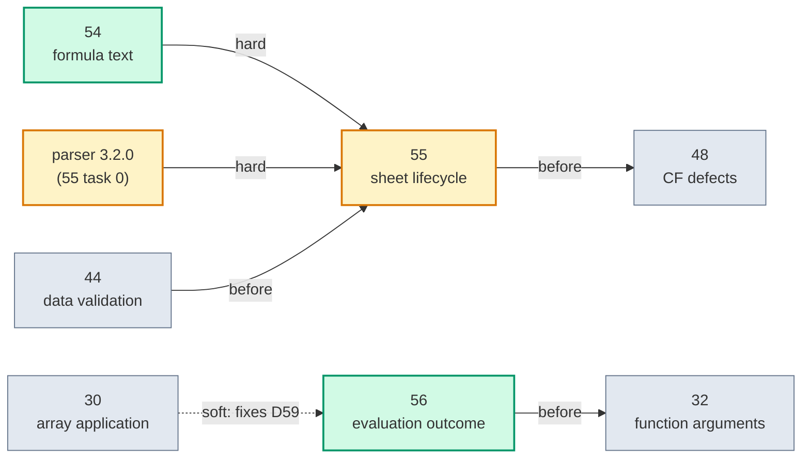

# Tasklist — Architecture deepening, round 4 (specs 54–56)

Progress board and parallel-execution plan for the three architecture specs that came out of the
**2026-09-13** architecture review. Rounds 1–3 have their own boards:
[TASKLIST-architecture-deepening.md](TASKLIST-architecture-deepening.md),
[-2](TASKLIST-architecture-deepening-2.md), [-3](TASKLIST-architecture-deepening-3.md).

**Update this file as tasks land.** Tick the boxes, and put the PR number next to the task.

## What this round did differently

**It was scoped to what changed.** Nine of the ten library fixes merged since round 3 landed on the
formula pipeline, each fixing one syntax form on one path. The review looked there first, and at the
two areas next to it: the calc engine's failure model, and defined names.

**Every design decision was taken by the owner, in a forty-question design interview**, before a line
of spec was written. Each spec carries a *Decisions* table. Two decisions passed the ADR test (hard to
reverse, surprising, a real trade-off) and are the repo's first ADRs:

- `docs/adr/0001-save-policy-on-evaluation-failure.md` — save writes no cached value for an expected
  failure and throws on a defect (spec 56).
- `docs/adr/0002-refused-formula-never-rewritten.md` — a refused formula is never rewritten by
  reference (specs 54, 55).

The vocabulary is in **`CONTEXT.md`** at the repo root, also new this round: *formula text*,
*refused formula*, *future function*, *cached value*, *dirty*, *circular reference*, *error value*,
*unsupported feature*, *defect*, *defined name*, *scope*, *3D reference*, *unsupported sheet*.

**Every defect was executed against a scratch build at `d68dffdc`.** Thirteen confirmed (D49–D61), one
refuted, and one found in passing (D62). Findings that were read but not executed are marked so in each
spec, and each spec's task 1 executes them.

## What this round found

The same shape as rounds 1–3 — **one fact, several implementations, kept in agreement by hand** — plus
two variants worth naming:

| Spec | Shape | Effect |
|---|---|---|
| 54 | Eight call sites into the parser, six refusal policies | A sheet rename throws a dependency's exception after part of the rename is done (D49). `_XLFN.` in upper case gives `#NAME?` (D50). SUBTOTAL leaks the parser's exception (D51). A colon in a table column name gives `#REF!` (D52) |
| 55 | **A seam that covers one event of two.** `IWorkbookListener` hears about rename, never about delete | The public delete door leaves dependents reading, and saving, a deleted sheet's values (D53). A sheet-scoped name dangles (D54). Rename skips `Sheet1!Local` and 3D references (D55). The rewriter writes `#REF!#REF!` (D56, latent) |
| 56 | **A classifier that works by exception type.** `NotImplementedException` means both "unsupported" and "broken" | Internal exception types escape public calls (D57, D58). A name calling `ROW()` fails in a cell (D60). Save swallows defects (D61) |

## 1. Progress board

| Spec | Title | Effort | Blocked by | Status |
|---|---|---|---|---|
| [54](54-formula-text-module.md) | Formula text gets one module | M | — | ⬜ Ready |
| [55](55-sheet-lifecycle-one-door.md) | Sheet delete and rename through one door | L | **54**; parser 3.2.0 (its task 0); **owner fixtures** for tasks 3, 5, 6; after **44** | ⬜ Blocked |
| [56](56-evaluation-outcome.md) | Evaluation failures get one outcome | M | — (**before 32**) | ⬜ Ready |

### Spec 54 — Formula text module ⬜ Ready

- [ ] **54.1** Corpus of today's behaviour; D49–D52 land red — PR #___
- [ ] **54.2** `FormulaText` and `FormulaRefusal`, inert — PR #___
- [ ] **54.3** Evaluation, conversion, rewrite; `FormulaTransformation` deleted; D50, D52 green — PR #___
- [ ] **54.4** Name references, extent, shifter; `FormulaShifterCorpus.tsv` unchanged — PR #___
- [ ] **54.5** SUBTOTAL check and rename; D51, D49 green — PR #___
- [ ] **54.6** The `=` rule; delete `DefaultFormulaVisitor` — PR #___
- [ ] **54.7** Cost: medians of three, **revert authority above 10%** — PR #___
- [ ] **54.8** Changelog — PR #___

### Spec 55 — Sheet lifecycle ⬜ Blocked on 54

- [ ] **55.0** Parser fork 3.2.0: `Sheet!#REF!` on delete, endpoint-aware 3D hook; XLibur bump — fork PR #___ / PR #___
- [ ] **55.1** Holder × event characterization; D53–D55 land red; execute the read findings — PR #___
- [ ] **55.2** The door and the port; D53 green — PR #___
- [ ] **55.3** Names at every scope, gate removed, 3D narrowing; D54–D56 green *(fixtures)* — PR #___
- [ ] **55.4** Cell formulas rewritten to `#REF!` on delete — PR #___
- [ ] **55.5** Validation, conditional formats, hyperlinks, print-area text *(fixtures)* — PR #___
- [ ] **55.6** Charts and the pivot cache source *(fixtures)* — PR #___
- [ ] **55.7** `Position` setter; unsupported-sheet names — PR #___
- [ ] **55.8** Cost, recorded — PR #___
- [ ] **55.9** Changelog (`fix!:`) — PR #___

### Spec 56 — Evaluation outcome ⬜ Ready

- [ ] **56.1** The matrix; D57, D58, D60, D61 land red — PR #___
- [ ] **56.2** Kinds: `UnsupportedFeatureException`, public `XLCircularReferenceException`; D58 green — PR #___
- [ ] **56.3** The policy table — PR #___
- [ ] **56.4** Save (ADR 0001); D61 green — PR #___
- [ ] **56.5** Recalculation skips cycles; `Evaluate` recursive (D57); names get their cell (D60) — PR #___
- [ ] **56.6** Report mapping; all four test projects — PR #___
- [ ] **56.7** Changelog (`feat:`, `fix!:`) — PR #___

## 2. Owner actions before dispatch

Spec 55 needs four Excel-authored fixtures (spec 55, design §5 has the recipes). Tasks 3, 5 and 6 stay
blocked until they exist; the implementing agent does not guess.

- [ ] `rename-before.xlsx` / `rename-after.xlsx`
- [ ] `delete-before.xlsx` / `delete-after.xlsx`
- [ ] `refdelete-before.xlsx` / `refdelete-after.xlsx`
- [ ] `chartsheet-name.xlsx`

Specs 54 and 56 need none.

## 3. Dependency graph



## 4. Conflict map

### 4.1 File ownership

| Spec | Production files |
|---|---|
| **54** | `CalcEngine/FormulaText.cs` *(new)* · `Visitors/FormulaTransformation.cs` *(deleted)* · `FormulaParser.cs` · `CalcContext.cs` *(SUBTOTAL helper)* · `Visitors/FormulaReferences.cs` · `Visitors/FormulaExtent.cs` · `Cells/XLCellFormulaShifter.cs` *(parse calls)* · `Cells/XLCellFormula.cs` · `Cells/XLCell.cs` *(`:605`, `:631`, `:910`)* · `Ranges/XLRangeBase.cs` *(`:114`)* · `IO/WorksheetSheetDataReader.cs` *(`:1050-1056`)* · `DefinedNames/XLDefinedName.cs` · `AstNode.cs` · `Functions/Lookup.cs` *(`:796-798`)* · `DefaultFormulaVisitor.cs` *(deleted)* |
| **55** | parser fork · `XLibur.csproj` · `Cells/IWorkbookListener.cs` · `XLWorksheets.cs` · `XLWorksheet.cs` *(`Delete`, `Name`, `Position`)* · `XLWorkbook.cs` *(`:1370`)* · `CalcEngine/XLCalcEngine.cs` *(`OnDeletingSheet`)* · `Cells/XLCellsCollection.cs` · `DefinedNames/*` · `Visitors/RenameRefModVisitor.cs` · one adapter each in `DataValidation/`, `ConditionalFormats/`, `Charts/`, `PivotTables/XLPivotSourceReference.cs`, `Hyperlinks/`, `PageSetup/XLPrintAreas.cs` |
| **56** | `CalcEngine/Exceptions/*` · `CalcEngine/EvaluationPolicy.cs` *(new)* · `CalculationVisitor.cs` *(`:123`)* · `XLCalcEngine.cs` *(`EvaluateName`, `:428`, `:495`, recalculation loop)* · `Functions/SignatureAdapter.cs` *(`:1249-1263`)* · `XLFunctionLibrary.cs` · `Cells/XLCell.cs` *(`:315`, `:343`)* · `Ranges/XLRangeBase.cs` *(`:588`)* · `XLWorkbook.cs` *(`:944`, `:993`, `:1192`)* · `IO/SheetDataWriter.cs` *(`:386-399`)* · `PublicAPI.Unshipped.txt` · `XLibur.Report/Ranges/CellEvaluator.cs` |

### 4.2 Pairs

| Pair | Shared ground | Severity | Resolution |
|---|---|---|---|
| **54 → 55** | `FormulaText`; `XLCellFormula.cs`; `XLDefinedName.cs` | 🔴 Hard | 54 first, in full |
| **parser 3.2.0 → 55** | the rewriter's output | 🔴 Hard | 55's task 0 |
| **44 → 55** | validation module and writer | 🔴 Hard | 44 first; 55 adds one listener to the reorganised module |
| **55 → 48, 49** | conditional-format module | 🔴 Hard | 55 first; it adds only a listener, and 48 and 49 then work inside the module |
| **56 → 32** | `SignatureAdapter.cs` | 🔴 Hard | 56 changes three throw sites; 32 rewrites the file |
| **54 ↔ 56** | `XLCell.cs`, different regions | 🟡 Soft | Either order |
| **54 ↔ 42** | `XLRangeBase.cs:114`, the array-formula setter | 🟡 Soft | Trivial rebase either way |
| **56 ↔ 42, 43** | `XLCalcEngine.cs`, adjacent regions | 🟡 Soft | Whichever lands second rebases |
| **56 ↔ 30** | `CalculationVisitor.cs`; 30 fixes D59 | 🟡 Soft | Either order; if 30 is first, D59's test becomes a regression test |
| **56 ↔ 45** | `SheetDataWriter.cs`, different methods | 🟡 Soft | Either order |
| **55 ↔ 41** | `PivotTableCacheDefinitionPartWriter.cs`, different regions | 🟡 Soft | Either order |
| **55 ↔ 56** | `XLWorkbook.cs`, different regions | 🟡 Soft | Either order |
| **54 ↔ 04, 08** | `CalcContext.cs` | 🟡 Soft | 54 touches only the SUBTOTAL helper |
| **55 ↔ 31** | worksheet part writers | 🟢 None | Unless 55's task 5 needs the validation writer; then after 31 |

**One shared file to watch:** `README.md` and this tasklist. Each spec updates its own row. Expect
trivial merge conflicts, and resolve them by keeping both edits.

## 5. Wave plan

```
Wave 1, now:     Agent A ──> 54        Agent C ──> 56
Wave 2:          Agent B ──> 55 task 0 (parser fork) — can start during wave 1
                 Agent B ──> 55 tasks 1–9, after 54 has merged and 44 has landed,
                             with the owner's fixtures in place for 3, 5 and 6
```

54 and 56 overlap only in `XLCell.cs`, in different regions, so they can run in parallel. 55's task 0
lives in a different repository and can start at once.

**If only one thing is done this round: 54.** The codebase is changing there now, it has the
half-applied rename, and 55 is built on it.

## 6. Ground rules

Inherited from `README.md`; repeated here so a brief is self-contained.

- **Branch per spec; never commit to `main`.** Branches: `refactor/54-formula-text`,
  `fix/55-sheet-lifecycle`, `fix/56-evaluation-outcome`. Commit prefixes: `refactor:`, `fix:`, `feat:`,
  `test:`, `perf:`; `!` for a behaviour change a caller can see.
- **Warnings are errors**, and nullable is enabled.
- **No compound shell commands** (`&&`, `||`, `;`) — one command per call.
- **Do not use `sed -i` on tracked files.** It rewrites CRLF files as LF. Use the Edit/Write tools, and
  check `git diff --numstat` afterwards.
- **Do not upgrade SixLabors.Fonts.**
- **Test filtering uses `--treenode-filter`, not `--filter`.** Exit 5 = bad option; exit 8 = zero tests
  matched. Name the `.csproj`, never the solution. Pass `-f net10.0` while iterating; run both TFMs
  before the PR.
- **Run all four test projects** before opening a PR: `XLibur.Tests`, `XLibur.Report.Tests`,
  `XLibur.Fonts.SixLabors.Tests`, `XLibur.Fonts.SkiaSharp.Tests`.
- **Perf claims need BenchmarkDotNet**, three runs, medians. The machine has ~40% run-to-run variance.
- **CHANGELOG.md entries go under `## Unreleased`.**
- **Read `CONTEXT.md` and the ADRs** before naming anything. Use the glossary's words.
- **Line numbers are from `d68dffdc`, 2026-09-13.** Verify before editing.

## 7. What "done" looks like

| Spec | Headline check |
|---|---|
| **54** | Only `FormulaText.cs` calls the parser; one `catch (ParsingException)` in the library; `FormulaTransformation.cs` gone; D49–D52 green; shifter corpus unchanged; benchmarks within 10% |
| **55** | `IWorkbookListener` has two members; `ws.Delete()` is one line; D53–D56 green; every holder matches an Excel fixture or has a recorded reason; parser at 3.2.0 |
| **56** | No `new NotImplementedException` in the calc engine; one missing-context translation; `XLCircularReferenceException` public; D57, D58, D60, D61 green; a workbook with a cycle opens with recalculate-on-load |

Across all three: all four test projects green on net8.0 and net10.0, and no existing assertion
weakened except where a spec names the behaviour change and its commit says so.

## 8. Surfaced but not specced

### Candidates from the review that the owner did not pick

Recorded so the next review does not walk them again. Evidence is in the round-4 review report.

| Candidate | Evidence | Why not now |
|---|---|---|
| **Defined names become one workbook-wide table, print areas and titles included** | A print area is stored in three forms, and only one has a lifecycle. "Sheet scope, then workbook scope" is re-implemented at 13 sites. **Read, not executed:** `DefinedNameReader.cs:81,113` compares a file's `sheetId` against a position (`:100` uses position), so an OFFSET print area attaches to the wrong sheet when `sheetId`s are out of tab order. `XLPrintAreas.cs:26` shares the source sheet's range objects with a copy (`XLWorksheet.cs:727`) | Not picked. Depends on 55. The two read defects are small standalone fixes |
| **The error token gets one codec** | Adding errors in #478 touched 5 files. An unknown error token silently blanks a cell (`WorksheetSheetDataReader.cs:1128`) but fails a whole pivot load | Not picked. Small and low-risk; overlaps 41 at the edges |
| **Pivot sources: one adapter posing as a seam** | 4 of 5 `TryGetSource` implementations are stubs; what varies is a type switch in the writer, ending in `UnreachableException` | Not picked. No defect behind it |

### Follow-on candidates the interview created

- **Sheet copy** (out of 55 by Q29). `XLWorksheet.CopyTo` hard-codes about 20 steps, with ordering kept
  in a comment (`:736`). Inventory: cell formulas and names are re-pointed; validation, conditional
  formats and hyperlinks are copied verbatim, so they still name the source sheet; charts are not
  copied at all; print areas share the source's range objects.
- **INDIRECT's reference parser** (out of 54 by Q3). `Lookup.cs:700-779` parses references with
  `Split(':')`, regexes and its own R1C1 regex — a fourth reference parser, with no parser behind it.

### Incidentals — one-line fixes, not deepenings

- **D62** — `D3` is accepted as a defined name, though it is a cell address (executed).
- `XLWorkbook_Save.DeleteDefinedNamesForSheet` edits XML that `WorkbookPartWriter` then replaces
  wholesale — dead (read).
- `DependenciesVisitor` re-parses every defined name on every visit, bypassing `ExpressionCache`
  (`DependenciesVisitor.cs:183`) (read).
- `Broadcast(rows, columns)` and `ScalarArray(value, columns, rows)` take their sizes in opposite
  orders (read).
- "An axis that isn't named spans the whole sheet" is written four times on the parser side
  (`ReferenceAreaExtensions.cs:46`, `AstNode.cs:383`, `FormulaExtent.cs:83`,
  `XLCellFormulaShifter.cs:393`) — spec 36's remainder, on a different input type (read).
- `EvaluateName` builds a fresh context, which silently resets spec 53's `IntersectOperands`. Spec 56
  task 5 touches this; its test pins the result (read).
- A loaded `_xlnm._FilterDatabase` is visible in `ws.DefinedNames`, shifted and copied, then dropped on
  save even when there is no AutoFilter to rebuild it from (read).
- The slicer and timeline cache writers add `"#N/A"` names to the model *during save*
  (`XLWorkbook_Save.cs:188-191`) (read).
