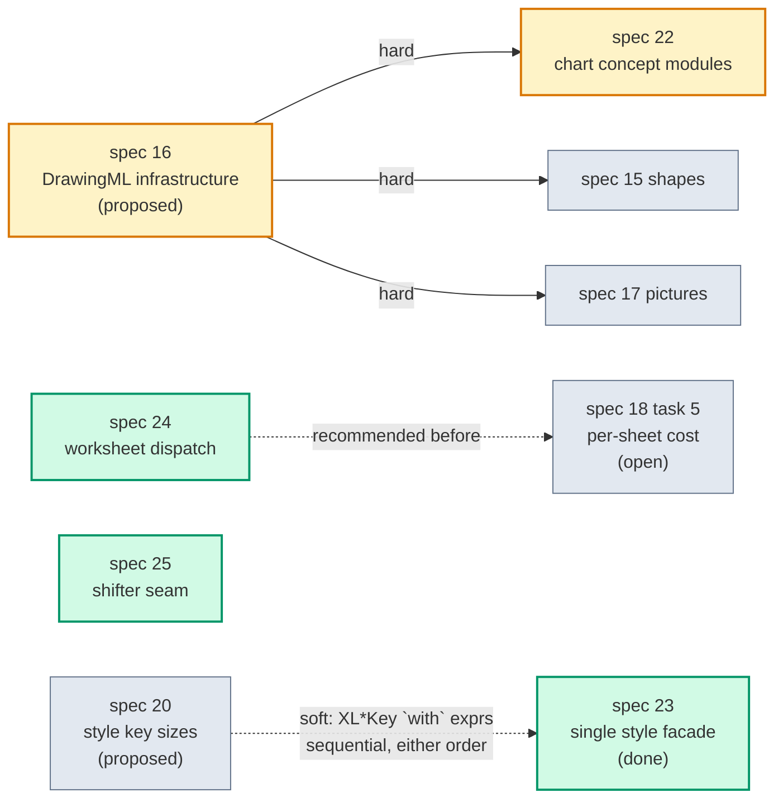

# Tasklist — Architecture deepening (specs 22–25)

Progress board and parallel-execution plan for the four architecture specs that came out of the
2026-08-23 architecture review. Each spec deepens a module: fewer entry points, more behaviour behind
them, one place to change and one place to test.

**Update this file as tasks land.** Tick the boxes, and put the PR number next to the task.

| Spec | Title | Effort | Blocked by | Status |
|---|---|---|---|---|
| [22](22-chart-concept-modules.md) | Chart IO: one module per chart concept | M | **spec 16 (all tasks)** | ✅ Done — run *before* 16, see Results |
| [23](23-single-style-facade.md) | One implementation per style interface | M | — (soft: spec 20) | ✅ Done |
| [24](24-worksheet-element-dispatch.md) | Worksheet element load gets one interface | S–M | — (conflicts: spec 18 task 5) | ⬜ Ready |
| [25](25-formula-shifter-seam.md) | Narrow the shifter fallback, name its seam | S | — | ⬜ Ready |

---

## 1. Progress board

### Spec 22 — Chart concept modules ✅ Done

Tasks are **strictly sequential** — all five touch `ChartFormatting.cs`. One owner, one branch.

Run on branch `task/22` against `ChartFormatting.cs` as it stood before spec 16, which had not been
scheduled. **Spec 16 now rebases onto the five concept modules rather than the other way round** —
its DrawingML extraction lands in `Charts/ChartSeriesFormatXml.cs`, which is where every colour,
fill and outline helper now lives.

- [x] **22.0** Golden byte-identity baseline for the chart corpus — `e03b086c`
- [x] **22.1** `ChartLegendXml` — the pattern-setting extraction — `d2c37a32`
- [x] **22.2** `ChartTitleXml` — `623b6e85`
- [x] **22.3** `ChartAxisXml` — `4c4056c2`
- [x] **22.4** `ChartDataLabelsXml` — `0e9dd7c3`
- [x] **22.5** `ChartSeriesFormatXml` — `10352980`
- [x] **22.6** Delete `ChartFormatting.cs`; ordering moves to `ChartElementOrder` — `22774e27`

**Against the acceptance criteria.** `ChartFormatting.cs` is gone; no `Build*` entry point survives;
`PublicAPI.Unshipped.txt` untouched; full suite green on net8.0 and net10.0 after every task. Two
counts came in above target, both for reasons the spec's own interface section implies:

- **13 entry points across the five modules, not ≤12** (from 21). The two the spec did not foresee
  are `ChartTitleXml.LiteralText`, which the axis title needs because it is the same `c:tx` block
  under a different parent, and `ChartSeriesFormatXml.ApplyChartTypeDefaults` — see below.
- **25 call sites, not ≤12** (from 29). The spec's own interfaces fix most of this: `ChartAxisXml`
  reads and writes one axis at a time, and a chart has three; data labels exist at two levels; the
  title has a standard and an extended flavour. Collapsing them further would mean adding wrapper
  entry points, which trades criterion 3 against criterion 2.

**Where "Build is Apply against an absent element" did not hold.** Twice, both recorded in the
commits:

- **The title.** Only `PatchTitle` kept `c:autoTitleDeleted` in step; the writer never wrote it. The
  golden fixture `bar-titled` was re-baselined to gain `<c:autoTitleDeleted val="0"/>`, which is what
  Excel itself writes and repeats the schema default.
- **The series' chart-type defaults.** An explicit `<c:symbol val="auto"/>` on a `LineWithMarkers`
  series and `<c:smooth val="1"/>` on an `XYScatterSmoothLines` one are properties of the chart type,
  not of the model. Folding them into `Apply` would have made the patcher conjure them into a loaded
  chart nobody edited, so they kept a separate entry point that only the writer calls.

Three further behaviours were brought into line, each towards what the writer already did: a
`c:marker` created for a size or fill alone now writes its `c:symbol`; a `c:spPr` created for a fill
and outline that both turn out absent is removed again; and the axis unit elements are now gated on
the element being a `c:valAx`, so a bubble chart's `c:catAx` can no longer be given a `c:majorUnit`
`CT_CatAx` has no place for.

### Spec 23 — Single style facade ✅ Done

Tasks are **strictly sequential**. Task 1 lands red on purpose; task 4 turns it green.

- [x] **23.1** Prove the divergence — exhaustive batch-vs-direct parity test *(landed failing on `InsideBorder` only, not the two predicted)* — branch `task/23`
- [x] **23.2** `XLStyle` gains the pending-key batching mode *(inert until 23.4)* — branch `task/23`
- [x] **23.3** Facades read their key from the style, not a cached value — branch `task/23`
- [x] **23.4** Route `Batch` through the mode; delete the seven deferred types *(713 lines)* — branch `task/23`
- [x] **23.5** Confirm batching still pays for itself *(caught a 2.4x regression, fixed at cause; not reverted)* — branch `task/23`

### Spec 24 — Worksheet element dispatch ⬜ Ready

- [ ] **24.1** Characterization test: every element survives a round trip — PR #___
- [ ] **24.2** Context and state structs; `TryLoad` with the dispatch moved in — PR #___
- [ ] **24.3** Move the three orphan handlers off `XLWorkbook_Load` — PR #___
- [ ] **24.4** Confirm the per-sheet load cost is unchanged — PR #___

### Spec 25 — Formula shifter seam ⬜ Ready

- [ ] **25.1** Prove the fallback is reachable; pin what takes it — PR #___
- [ ] **25.2** Narrow `catch (Exception)` to `catch (ParsingException)` — PR #___
- [ ] **25.3** Name the seam; route the single-block path through it — PR #___
- [ ] **25.4** Give the fallback its own corpus rows — PR #___

---

## 2. Dependency graph



---

## 3. Conflict map

### 3.1 Specs 22–25 against each other: fully disjoint

No file is touched by more than one of the four. **This is what makes them safely parallel.**

| Spec | Production files |
|---|---|
| **22** | `Excel/IO/ChartFormatting.cs` · `ChartWriter.cs` · `ChartReader.cs` · `ChartPatcher.cs` · `Excel/IO/Charts/*` |
| **23** | `Excel/Style/XLStyle.cs` · `XLBorder.cs` · `XLFont.cs` · `XLFill.cs` · `XLAlignment.cs` · `XLNumberFormat.cs` · `XLProtection.cs` · `XLDeferred*.cs` |
| **24** | `Excel/IO/WorksheetElementReader.cs` · `Excel/IO/WorksheetElementContext.cs` · `Excel/XLWorkbook_Load.cs` |
| **25** | `Excel/Cells/XLCellFormulaShifter.cs` |

Test files are disjoint too — `Tests/Excel/Charts/*`, `Tests/Excel/Styles/*`, `Tests/Excel/IO/*`,
`Tests/Excel/Cells/FormulaShifterCorpusTests.cs`.

**One shared file to watch:** `docs/specs/README.md` and this tasklist. Every spec updates its own
row. Expect trivial merge conflicts here and resolve them by keeping both edits.

### 3.2 Against the open specs

| Pair | Shared ground | Severity | Resolution |
|---|---|---|---|
| **22 ↔ 16** | `Excel/IO/ChartFormatting.cs` | 🔴 Hard | **16 lands first, in full.** 16 task 3 extracts the DrawingML property layer out of `ChartFormatting`; 22 then reorganises what is left. 16's task 1 change-set harness is also the gate 22 wants — reuse it and skip most of 22.0. |
| **22 ↔ 15, 17** | via 16 only | 🟢 None direct | 15 and 17 both hard-depend on 16. Once 16 lands, 22 and 15/17 are disjoint: 15/17 live in `PictureWriter.cs` and new shape code, 22 in the chart tree. |
| **23 ↔ 20** | `XL*Key.cs` field names, read by the facades' `with` expressions | 🟡 Soft | **23 landed first; 20 rebases onto it.** 20's task 0 size probe now has a second reason to run: `XLStyle.PendingKey` holds the six component keys inline, so shrinking them shrinks the batch holder too, and spec 23's Results record that `XLStyleKey`'s size is what made an inline pending key untenable. |
| **24 ↔ 18 task 5** | `XLWorkbook_Load.LoadWorksheetElements` | 🔴 Hard | **24 first, recommended.** 24 is behaviour-preserving and mechanical; it leaves 18 task 5 one method to optimise instead of four across two modules. 18 task 5 is still only *attributed*, not designed, so it has nothing to rebase. If 18 task 5 starts first, 24 waits — never rebase a perf change onto a structural one. |
| **25 ↔ anything** | — | 🟢 None | No open spec touches `XLCellFormulaShifter*.cs`. |
| **23 ↔ 11 task 4** | `XLStylizedBase.ModifyStyle`/`SetStyle` | 🟢 None | 11 task 4 is **done**. 23 builds on it and does not re-enter it. |
| **24 ↔ 02** | `WorksheetSheetDataReader` | 🟢 None | 02 is **done**. 24 calls `LoadColumns` but does not modify it. |

---

## 4. Wave plan

### Wave 1 — three specs in parallel, starting now

```
Agent A ──> spec 23  (style facades)        Excel/Style/*
Agent B ──> spec 24  (worksheet dispatch)   Excel/IO/WorksheetElementReader.cs, Excel/XLWorkbook_Load.cs
Agent C ──> spec 25  (shifter seam)         Excel/Cells/XLCellFormulaShifter.cs
```

Zero file overlap. Three branches off `main`, three PR streams, no coordination needed beyond the
README/tasklist rows.

**Preconditions before dispatching:**
- Confirm nobody is running **spec 20** → else hold Agent A.
- Confirm nobody is running **spec 18 task 5** → else hold Agent B.
- Agent C has no precondition.

**Within a spec, tasks are strictly sequential.** Do not split spec 23's five tasks across agents —
tasks 2, 3 and 4 all edit `XLStyle.cs`, and task 4 is only meaningful once 2 and 3 are green.

### Wave 2 — spec 22, after spec 16

Spec 16 is itself three tasks (harness → anchor factory → shape-properties writer), with 2 and 3
independent of each other once 1 lands. Spec 22 needs **all three**.

```
spec 16 task 1 ──> spec 16 task 2 ─┐
                   spec 16 task 3 ─┴──> spec 22 (tasks 0–6, sequential, one owner)
```

If spec 16 is not going to be scheduled soon, spec 22 can be run against today's `ChartFormatting`
at the cost of a hard conflict with 16 later. **Not recommended** — 16 is a hard prerequisite for
specs 15 and 17 as well, so it is on the critical path regardless, and rebasing 22 onto it would mean
redoing five extractions.

---

## 5. Agent briefs

Each brief is self-contained. Hand one to an agent with the linked spec.

### Brief A — spec 23, single style facade

> Implement `docs/specs/23-single-style-facade.md`, tasks 1 through 5, in order.
>
> Branch: `refactor/23-single-style-facade` off `main`. Never commit to `main`.
>
> This spec deletes 713 lines by making `IXLStyle.Batch` a flush policy on the one style facade
> rather than a second parallel implementation of seven interfaces. It closes a real defect: for a
> cell, `Style.Border.InsideBorder = x` is a no-op (correct — a 1×1 range has no interior) while
> `Style.Batch(s => s.Border.InsideBorder = x)` sets all four edges (wrong).
>
> Task 1 **lands failing** — that is deliberate, and the commit message must say which cases fail.
> Task 4 is what turns it green. Task 5 is empowered to revert tasks 2–4 if batching regresses more
> than 10% on the median of three benchmark runs; escalate rather than tuning blindly.
>
> Do not touch `XL*Key.cs` — that is spec 20's territory. If you need a key field renamed, stop and
> report.
>
> Gate after every task: `dotnet test XLibur.Tests/XLibur.Tests.csproj -f net10.0`

### Brief B — spec 24, worksheet element dispatch

> Implement `docs/specs/24-worksheet-element-dispatch.md`, tasks 1 through 4, in order.
>
> Branch: `refactor/24-worksheet-element-dispatch` off `main`. Never commit to `main`.
>
> This spec moves the element-name dispatch out of `XLWorkbook_Load` and into the reader that owns
> the element bodies: 14 entry points become 1. Behaviour-preserving throughout.
>
> Two things must not change: the deliberate two-pass load (`<sheetData>` skipped in pass 1, read in
> pass 2 with a raw `XmlReader`), and the per-sheet structural cost, which spec 18 task 5 measures at
> ~1.0 ms / ~0.19 MB. Task 4 is the check on the second.
>
> If task 1's round-trip test cannot be made to pass for some element without weakening an
> assertion, that is a pre-existing defect — record it, do not paper over it.
>
> Gate after every task: `dotnet test XLibur.Tests/XLibur.Tests.csproj -f net10.0`

### Brief C — spec 25, formula shifter seam

> Implement `docs/specs/25-formula-shifter-seam.md`, tasks 1 through 4, in order.
>
> Branch: `fix/25-formula-shifter-seam` off `main`. Never commit to `main`.
>
> This spec narrows `catch (Exception)` to `catch (ParsingException)` in the shifter, so a bug in
> XLibur's own shift logic stops being silently answered by the regex fallback, and names the seam so
> the fallback is directly testable.
>
> **The most valuable outcome of this spec is a test that starts throwing at task 2.** That would be
> a real bug the broad catch was hiding. If it happens: do not widen the catch back. Record the
> formula and the exception, fix the defect in `ShiftPlan`, and write it up in the spec's Results
> section.
>
> Do not reconcile the 9 recorded divergences between the parser and regex columns of
> `FormulaShifterCorpus.tsv`. They are pinned behaviour and out of scope.
>
> Gate after every task: `dotnet test XLibur.Tests/XLibur.Tests.csproj -f net10.0`

### Brief D — spec 22, chart concept modules *(hold until spec 16 lands)*

> Implement `docs/specs/22-chart-concept-modules.md`, tasks 0 through 6, in order.
>
> Branch: `refactor/22-chart-concept-modules` off `main`. Never commit to `main`.
>
> **Do not start until all three tasks of spec 16 have landed.** Re-read `ChartFormatting.cs` first —
> spec 16 removes its DrawingML property layer, so this spec's line numbers will be stale even though
> its concept grouping will not.
>
> The central claim: `Build` is `Apply` against an absent element. Task 1 proves it for the legend
> and sets the pattern; tasks 2–5 copy that pattern. No `isNew` flag is needed anywhere — if you find
> yourself adding one, the collapse has gone wrong.
>
> Every task is gated by golden byte-identity of the chart part XML. Task 0 step 4 requires you to
> prove the gate can fail before trusting it. **A refactor gated by a test that cannot fail is not
> gated.**
>
> Gate after every task: `dotnet test XLibur.Tests/XLibur.Tests.csproj -f net10.0 --treenode-filter "/*/*/Chart*/*"`

---

## 6. Ground rules

Inherited from `docs/specs/README.md`; repeated here so a brief is self-contained.

- **Branch per spec; never commit to main.** Commit prefixes: `refactor:`, `fix:`, `test:`, `perf:`.
- **Warnings are errors** (`TreatWarningsAsErrors=true`); nullable is enabled — new code must be
  null-annotated.
- **No compound shell commands** (`&&`, `||`, `;`) in agent tool calls — one command per call.
- **Do not use `sed -i` on tracked files.** `.gitattributes` checks out CRLF; Git Bash's `sed -i`
  rewrites the file as LF and turns a one-line change into a whole-file diff. Use the Edit/Write
  tools. Verify with `git diff --numstat` — a file whose changed-line count approaches its total line
  count has been rewritten, not edited.
- **Do not upgrade SixLabors.Fonts** (license conflict).
- **Test filtering uses `--treenode-filter`, not `--filter`.** Exit 5 = invalid option; exit 8 = zero
  tests matched. Never filter at solution level — name the `.csproj`.
- **Pass `-f net10.0`** for iteration; the test project multi-targets, so an unfiltered run executes
  the suite twice. Run without `-f` before opening the PR.
- Build: `dotnet build XLibur/XLibur.csproj -c Release -v q`
- Benchmarks: `dotnet run -c Release --project XLibur.Benchmarks/XLibur.Benchmarks.csproj -- --filter '*Name*'`
- **Perf claims need BenchmarkDotNet.** The benchmark machine has ~40% run-to-run timing variance;
  a single run proves nothing. Take three and compare medians.
- **Line numbers in these specs are from 2026-08-23 — verify against current code before editing.**

---

## 7. What "done" looks like

| Spec | Headline check |
|---|---|
| **22** | `ChartFormatting.cs` gone; ≤12 entry points across five concept modules against today's 21; ≤12 call sites against today's 29; `grep -rn 'internal static.*Build' XLibur/Excel/IO/Charts/` returns nothing |
| **23** | Seven `XLDeferred*.cs` deleted; each style interface has exactly one implementation; all 14 parity cases green |
| **24** | `WorksheetElementReader` exposes one dispatch entry point; `XLWorkbook_Load.cs` names no worksheet element except the two it deliberately skips |
| **25** | No `catch (Exception)` in `XLCellFormulaShifter.cs`; fallback reached through one named method; external references exercised through `Shift` itself |

Across all four: **no public API change** (`PublicAPI.Unshipped.txt` untouched), full suite green on
net8.0 and net10.0, and no existing test assertion weakened.
